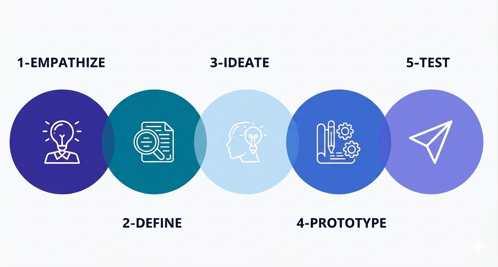
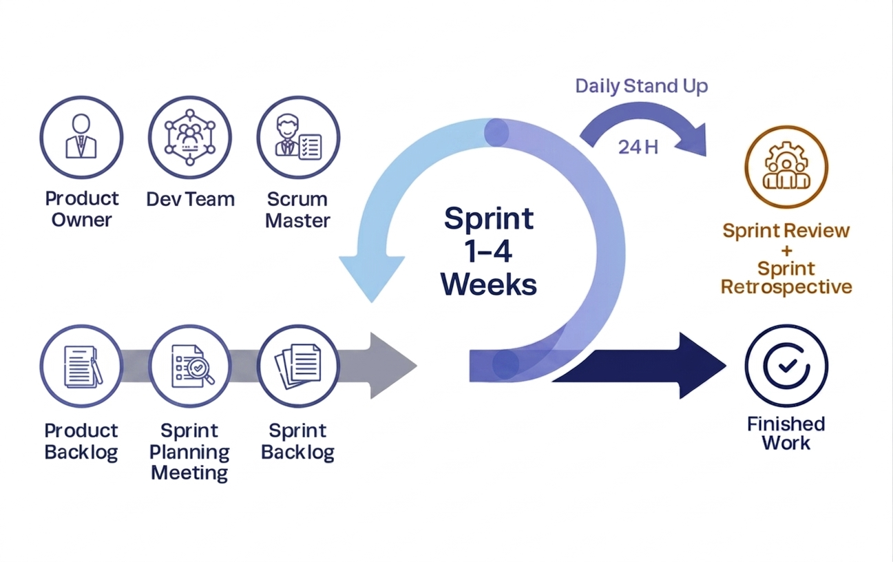
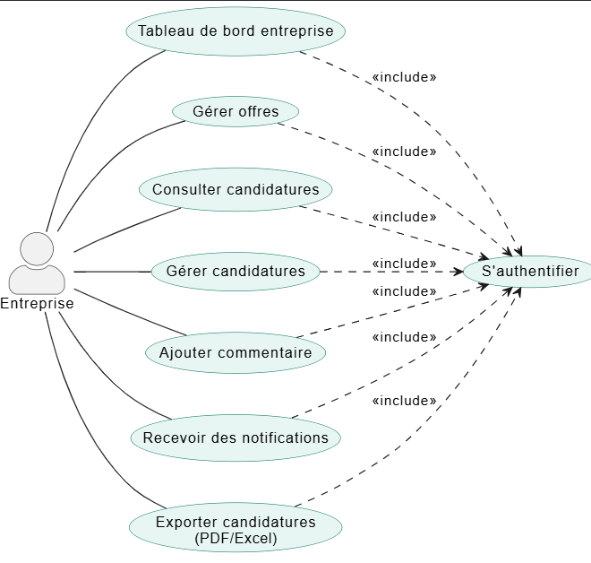
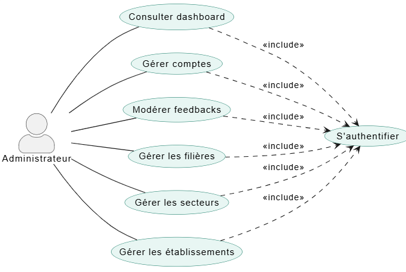
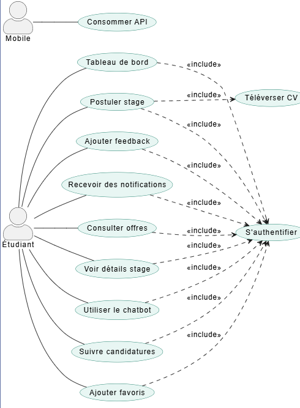
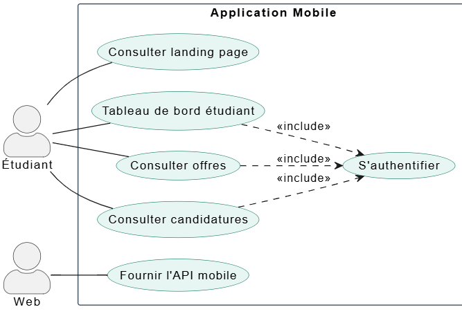
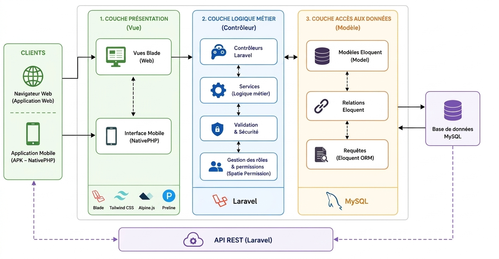

  
  

# **Projet de Fin de Formation**
### **StageFlow : Développement d’une Solution en ligne pour la recherche et la gestion des stages**

**Réalisée par :** Salma Akajou  
**Encadré par :** M. ESSARRAJ Fouad  
**Filière :** Développement Mobile 

---

## Sommaire

  

1

Contexte du projet

  

2

Méthodologie de travail

  

3

Branche Fonctionnelle

  

4

Conception

    

5

Réalisation

  

6

Conclusion

---
## 1. Contexte du projet

  

---

## 2. Méthodologie : Design Thinking

  

---

## Méthodologie : Scrum (Agile)

  

---

## 3. Branche Fonctionnelle : Design Thinking
###  DÉFINITION

  

    <h4>Cadrage du problème</h4>
    <blockquote style="font-style: italic; background: white; padding: 15px; border-radius: 8px;">
      
Les étudiants rencontrent des difficultés à trouver des stages adaptés et à suivre leurs candidatures, tandis que les entreprises manquent d’un moyen simple pour publier et gérer leurs offres, ce qui rend le processus de stage dispersé et inefficace.

      <h5>How Might We:</h5>
Comment pourrions-nous centraliser la recherche de stages et simplifier la gestion des offres et des candidatures pour les étudiants et les entreprises ?

    </blockquote>
    
  

---

## Branche Fonctionnelle : Cas d'utilisation global

### Diagramme cas d'utilisation global: Partie Public

  

---

## Branche Fonctionnelle : Cas d'utilisation

### Diagramme cas d'utilisation global: Partie Admin

**Espace Entreprise**

  

---

## Branche Fonctionnelle : Cas d'utilisation

### Diagramme cas d'utilisation global: Partie Admin

**Espace Admin**

  

---

## Branche Fonctionnelle : Cas d'utilisation

### Diagramme cas d'utilisation global: Partie Admin

**Espace Etudiant**

  

---

## Branche Fonctionnelle : Cas d'utilisation

### Diagramme cas d'utilisation global: Mobile

  

---

## 4. Conception : Diagramme de classe

<h3>Modélisation des données</h3>

  

---

## 5. Réalisation : Stack technique

  

    <h4>Backend</h4>
    <ul>
      <li><strong>Framework :</strong> Laravel 12</li>
      <li><strong>Base de données :</strong> MySQL</li>
      <li><strong>Architecture :</strong> MVC / N-Tiers</li>
    </ul>
  

  

    <h4>Frontend</h4>
    <ul>
      <li><strong>Preline, tailwind Css</strong></li>
      <li><strong>Alpine.js</strong></li>
      <li><strong>Lucide icons</strong></li>
    </ul>
  

  

---

## 5. Réalisation : Outils utilisés

  

    <ul>
      <li><strong>MySQL Workbench</strong></li>
      <li><strong>Github</strong></li>
    </ul>
  

  

    <ul>
      <li><strong>PlantUML</strong></li>
      <li><strong>Mermaid</strong></li>
    </ul>
  

---

## Réalisation : Architecture de projet

  

  

---

## 6. Conclusion

### Merci pour votre attention !