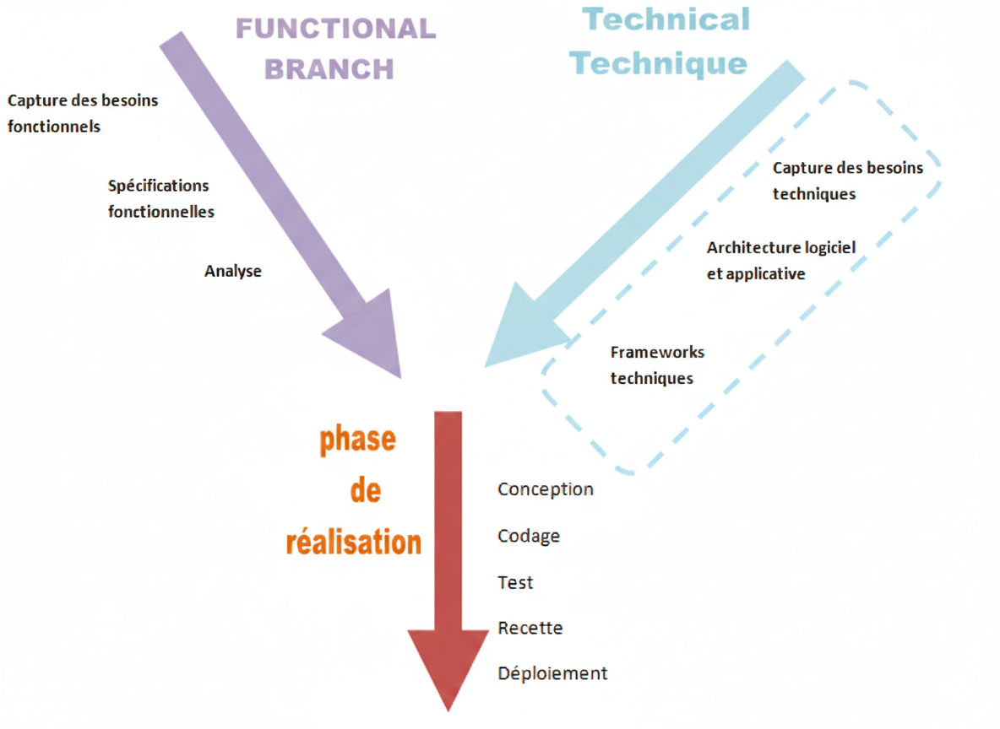

# Rapport de Projet de Fin de Formation  
## Application de gestion de files d’attente  
### Formation de Développement Mobile – Mode Bootcamp  

---

**Réalisée par :** Salma Akajou  
**Encadré par :** Mr. Essarraj Fouad  

**Année de Formation :** 2025/2026  

---

# Table des matières

1. [Liste des figures](#liste-des-figures)  
2. [Remerciement](#remerciement)  
3. [Introduction](#introduction)  
4. [Contexte de projet](#contexte-de-projet)  
5. [Objectif de Project](#objectif-de-project)  
6. [Cahier de charge](#cahier-de-charge)  
7. [Méthode de travail](#méthode-de-travail)  
8. [Scrum](#scrum)  
9. [La méthodologie 2TUP](#la-méthodologie-2tup)  
10. [Design Thinking](#design-thinking)  
11. [Branche fonctionnelle](#branche-fonctionnelle)  
12. [Carte d’empathie](#carte-dempathie)  
13. [Définition de problème](#définition-de-problème)  
14. [Diagramme de cas d’utilisation générale](#diagramme-de-cas-dutilisation-générale)  
15. [Diagramme de cas d’utilisation Sprint 1](#diagramme-de-cas-dutilisation-sprint-1)  
16. [Diagramme de cas d’utilisation Sprint 2](#diagramme-de-cas-dutilisation-sprint-2)  
17. [Branche technique](#branche-technique)  
18. [Choix technologiques](#choix-technologiques)  
19. [Architecture de projet](#architecture-de-projet)  
20. [Prototype (Fonctionnalités, Classes)](#prototype-fonctionnalités-classes)  
21. [Conception](#conception)  
22. [Diagramme de classe](#diagramme-de-classe)  
23. [Maquettes](#maquettes)  
24. [Charte graphique](#charte-graphique)  
25. [Réalisation](#réalisation)  
26. [Interfaces](#interfaces)  
27. [Conclusion](#conclusion)  

---

# Liste des figures

. 

---

# Remerciement

.  

---

# Introduction

Dans un contexte de digitalisation croissante, la gestion efficace des files d’attente est essentielle pour assurer une organisation fluide des entretiens à SoliCode. Une gestion peu structurée peut entraîner un manque de visibilité, des difficultés dans le suivi des candidats et un stress lié à l’attente.  

Pour répondre à ces défis, ce projet propose le développement d’une application de gestion des files d’attente basée sur des tickets numériques, une mise à jour en temps réel et des outils simples pour l’administration.  

L’objectif est d’améliorer l’organisation, de réduire l’incertitude des candidats et d’optimiser la gestion des sessions.  

---

# Contexte de projet

Dans le cadre de ma formation en développement web, nous sommes amenés à réaliser un projet de fin de formation mettant en pratique nos compétences techniques et méthodologiques. Ce projet doit répondre à un besoin concret observé dans notre environnement professionnel.  

En observant l’organisation des entretiens à SoliCode, j’ai constaté certaines difficultés liées à la gestion des files d’attente :  

- Absence de visibilité sur l’ordre de passage  
- Gestion manuelle des candidats  
- Manque d’informations en temps réel  

Ces limites peuvent entraîner du stress pour les candidats et compliquer le travail de l’administration.  

Face à cette situation, l’idée de développer une application de gestion des files d’attente est née. Cette solution vise à digitaliser le système de tickets, améliorer la visibilité pour les candidats et offrir à l’administration un outil simple et efficace pour organiser les sessions.  

---

# Objectif de Project

*(À compléter)*  

---

# Cahier de charge

*(À compléter)*  

---

# Méthode de travail

---

# Scrum

La méthodologie Scrum est une méthodologie agile qui permet de gérer un projet de manière flexible et collaborative, en favorisant la livraison progressive de fonctionnalités. Elle repose sur l’itération, la priorisation des tâches et la communication régulière entre les membres de l’équipe.  

Dans le cadre de ce projet, nous avons organisé le travail selon les principes de Scrum, ce qui nous a permis de mieux planifier, suivre et livrer les différentes fonctionnalités du blog de manière efficace.  

## Principes clés

- **Transparence :** Toutes les tâches et objectifs sont visibles par l’équipe.  
- **Inspection :** Chaque sprint est évalué pour détecter les améliorations possibles.  
- **Adaptation :** L’équipe ajuste le plan de travail selon les résultats des sprints précédents.  

---

# La méthodologie 2TUP

## Introduction
La méthodologie **2TUP (Two-Tracks Unified Process)** est un processus de développement logiciel qui s’appuie sur une structure en forme de Y. Elle permet de séparer, puis de réunir, deux dimensions essentielles d’un projet :
- **l’analyse fonctionnelle** (ce que doit faire le système)
- **la conception technique** (comment le réaliser)
Cette approche facilite une meilleure organisation du travail et garantit une compréhension claire des besoins avant la phase de développement. Le 2TUP est également **itératif et incrémental**, ce qui permet d’avancer progressivement avec des versions successives du produit.
## Principes clés du 2TUP
La méthode repose sur plusieurs fondements importants :
- **Itératif et incrémental** : le développement se fait par cycles, en ajoutant des fonctionnalités au fur et à mesure.
- **Piloté par les risques** : les éléments les plus critiques sont traités dès le début du projet.
- **Séparation fonctionnel / technique** : cela évite les confusions et permet une meilleure organisation du travail.
- **Architecture solide** : une base technique fiable est élaborée tôt dans le processus.
- **Collaboration continue** : les utilisateurs sont impliqués régulièrement pour valider les besoins.
## La structure en Y
Le 2TUP est représenté par un schéma en Y, qui reflète les trois grandes étapes du processus :
- **1- Phase initiale : Capture des besoins**

Cette phase consiste à comprendre les objectifs du projet, identifier les acteurs, et préciser les exigences globales.
- **2- Branche fonctionnelle (haut du Y)**

 Elle vise à analyser ce que doit faire le système : cas d’usage, processus métier, workflows, scénarios utilisateurs.
- **3- Branche technique (bas du Y)**

 Elle concerne la manière dont la solution sera construite : architecture, technologies, base de données, API, composants techniques.
- **4- Phase de convergence**
 Les deux branches se rejoignent pour lancer le développement, les tests, l’intégration et la livraison.

  

---

# Design Thinking

 

## Qu’est-ce que le Design Thinking ?
Le **Design Thinking** est une approche de résolution de problèmes centrée sur l’humain.
Elle vise à comprendre les besoins réels des utilisateurs pour créer des solutions innovantes.
Très utilisée dans le design, la technologie, l’éducation, l’innovation et les services.
## Pourquoi utiliser le Design Thinking ?
- Encourage la créativité et l’innovation
- Permet de développer des solutions réellement adaptées aux besoins des utilisateurs
- Favorise la collaboration entre équipes
- Utile pour résoudre des problèmes complexes ou mal définis
## Les 5 étapes du Design Thinking
1. **Empathie (Empathize)**:
Comprendre l’utilisateur : observer, interviewer, analyser
Objectif : découvrir ses besoins, ses motivations et ses difficultés
2. **Définition du problème (Define)**:
Regrouper et analyser les informations collectées
Formuler un problème clair et centré sur l’utilisateur
Exemple : « Comment pourrions-nous aider l’utilisateur à… ? »
3. **Idéation (Ideate)**:
-Générer un maximum d’idées sans jugement
-Utiliser des techniques comme le brainstorming, le mind mapping, ou les questions « Comment pourrions-nous ? »
-Encourager la créativité et les points de vue variés
4. **Prototype**:
- Créer des versions simplifiées ou maquettes des idées sélectionnées
- Peut être un dessin, un modèle, une interface simple, un scénario, etc.
- Objectif : expérimenter rapidement
5. **Test**:
- Tester les prototypes auprès des utilisateurs
- Recueillir leurs commentaires
- Améliorer, ajuster ou repenser la solution

---

# Branche fonctionnelle

## Carte d'empathie

---

# Carte d’empathie

*(À compléter)*  

---

# Définition de problème

*(À compléter)*  

---

# Diagramme de cas d’utilisation générale

*(À compléter)*  

---

# Diagramme de cas d’utilisation Sprint 1

*(À compléter)*  

---

# Diagramme de cas d’utilisation Sprint 2

*(À compléter)*  

---

# Branche technique

*(À compléter)*  

---

# Choix technologiques

*(À compléter)*  

---

# Architecture de projet

*(À compléter)*  

---

# Prototype (Fonctionnalités, Classes)

*(À compléter)*  

---

# Conception

*(À compléter)*  

---

# Diagramme de classe

*(À compléter)*  

---

# Maquettes

*(À compléter)*  

---

# Charte graphique

*(À compléter)*  

---

# Réalisation

*(À compléter)*  

---

# Interfaces

*(À compléter)*  

---

# Conclusion

*(À compléter)*  