# Rapport de Projet de Fin formation
**Stage Flow : Développement d’une Solution en ligne pour la recherche et gestion des stages**  
*Formation de développement Mobile – Mode Bootcamp*

---

**Réalisée par:** Salma Akajou  
**Encadré par:** Mr. Essarraj Fouad  
**Année de Formation :** 2025/2026  

---

## Table de matière

- [Liste des figures](#liste-des-figures)
- [Remerciement](#remerciement)
- [Introduction](#introduction)
- [Contexte de projet](#contexte-de-projet)
- [Cahier de charge](#cahier-de-charge)
- [Méthode de travail](#méthode-de-travail)
  - [Scrum](#scrum)
  - [Design thinking](#design-thinking)
  - [2TUP](#2tup)
- [Branche fonctionnelle](#branche-fonctionnelle)
  - [Carte d’empathie](#carte-dempathie)
  - [Définition de problème](#définition-de-problème)
  - [Idéation](#idéation)
  - [Diagramme de cas d’utilisation générale](#diagramme-de-cas-dutilisation-générale)
  - [Diagramme de cas d’utilisation sprint 1](#diagramme-de-cas-dutilisation-sprint-1)
  - [Diagramme de cas d’utilisation sprint 2](#diagramme-de-cas-dutilisation-sprint-2)
- [Branche technique](#branche-technique)
  - [Choix technologiques](#choix-technologiques)
  - [Architecture de projet](#architecture-de-projet)
  - [Prototype (Fonctionnalitées, Classes)](#prototype-fonctionnalitées-classes)
  - [Conception](#conception)
    - [Diagramme de classe](#diagramme-de-classe)
    - [Charte graphique](#charte-graphique)
    - [Maquettes](#maquettes)
- [Réalisation](#réalisation)
  - [Interfaces](#interfaces)
- [Conclusion](#conclusion)

---

## Liste des figures

- [Figure 1 : Contexte de projet](#figure-1--contexte-de-projet)
- [Figure 2 : Méthode Scrum](#figure-2--méthode-scrum)
- [Figure 3 : Design thinking](#figure-3--design-thinking)
- [Figure 4 : Processus 2TUP](#figure-4--processus-2tup)
- [Figure 5 : Carte d'empathie d'apprenant](#figure-5--carte-dempathie-dapprenant)
- [Figure 6 : Carte d'empathie d'entreprise](#figure-6--carte-dempathie-dentreprise)
- [Figure 7 : Carte d'empathie d'admin](#figure-7--carte-dempathie-dadmin)
- [Figure 8 : Diagramme de cas d'utilisation espace public](#figure-8--diagramme-de-cas-dutilisation-espace-public)
- [Figure 9 : Diagramme de cas d'utilisation espace étudiant](#figure-9--diagramme-de-cas-dutilisation-espace-étudiant)
- [Figure 10 : Diagramme de cas d'utilisation espace entreprise](#figure-10--diagramme-de-cas-dutilisation-espace-entreprise)
- [Figure 11 : Diagramme de cas d'utilisation admin](#figure-11--diagramme-de-cas-dutilisation-admin)
- [Figure 12 : Diagramme de cas d'utilisation Mobile](#figure-12--diagramme-de-cas-dutilisation-mobile)
- [Figure 13 : Diagramme de cas d'utilisation sprint 1 web](#figure-13--diagramme-de-cas-dutilisation-sprint-1-web)
- [Figure 14 : Diagramme de cas d'utilisation sprint 1 Mobile](#figure-14--diagramme-de-cas-dutilisation-sprint-1-mobile)
- [Figure 15 : Diagramme de cas d'utilisation sprint 2 web](#figure-15--diagramme-de-cas-dutilisation-sprint-2-web)
- [Figure 16 : Diagramme de cas d'utilisation sprint 2 Mobile](#figure-16--diagramme-de-cas-dutilisation-sprint-2-mobile)
- [Figure 17 : Diagramme de cas d'utilisation sprint 3](#figure-17--diagramme-de-cas-dutilisation-sprint-3)
- [Figure 18 : Architecture globale de projet](#figure-18--architecture-globale-de-projet)
- [Figure 19 : Diagramme de classe](#figure-19--diagramme-de-classe)
- [Figure 20 : Charte graphique](#figure-20--charte-graphique)
- [Figure 21 : Maquette Landing page](#figure-21--maquette-landing-page)
- [Figure 22 : Maquette Tableau de bord étudiant](#figure-22--maquette-tableau-de-bord-étudiant)
- [Figure 23 : Maquette Tableau de bord entreprise](#figure-23--maquette-tableau-de-bord-entreprise)
- [Figure 24 : Maquette Tableau de bord administrateur](#figure-24--maquette-tableau-de-bord-administrateur)
- [Figure 25 : Maquette de l'application mobile](#figure-25--maquette-de-lapplication-mobile)
- [Figure 26 : Interface Tableau de bord étudiant](#figure-26--interface-tableau-de-bord-étudiant)
- [Figure 27 : Interface Liste des offres](#figure-27--interface-liste-des-offres)
- [Figure 28 : Interface Candidatures étudiant](#figure-28--interface-candidatures-étudiant)
- [Figure 29 : Interface Tableau de bord entreprise](#figure-29--interface-tableau-de-bord-entreprise)
- [Figure 30 : Interface Gestion des offres](#figure-30--interface-gestion-des-offres)
- [Figure 31 : Interface Candidatures reçues](#figure-31--interface-candidatures-reçues)
- [Figure 32 : Interfaces de l'application mobile](#figure-32--interfaces-de-lapplication-mobile)

---

## Remerciement

Je tiens à adresser mes sincères remerciements à Monsieur ESSARRAJ Fouad pour son accompagnement tout au long de la réalisation de ce projet de fin d’études. Grâce à ses conseils avisés, sa disponibilité et son encadrement de qualité, j’ai pu développer mes compétences techniques et mener à bien ce travail dans les meilleures conditions.

Je lui suis particulièrement reconnaissante pour sa patience, ses remarques constructives et son soutien constant, qui ont été d’une grande aide à chaque étape du projet.

J’exprime également ma gratitude à l’ensemble des formateurs et de l’équipe pédagogique pour la qualité de la formation dispensée et pour les connaissances précieuses acquises durant mon parcours.

Enfin, je remercie chaleureusement toutes les personnes qui m’ont soutenue et encouragée de près ou de loin durant la réalisation de ce projet.

---

## Introduction

La recherche de stage constitue une étape essentielle dans le parcours des étudiants en formation supérieure, permettant de mettre en pratique les compétences acquises et de préparer l’insertion professionnelle. Cependant, de nombreux étudiants rencontrent des difficultés pour trouver des stages adaptés à leur profil, en raison de la dispersion des offres, d’informations souvent incomplètes et d’un suivi des candidatures complexe.

De leur côté, les entreprises éprouvent des difficultés à gérer efficacement les candidatures et à identifier rapidement les profils correspondant à leurs besoins. Face à ce constat, le projet StageFlow vise à centraliser les offres de stages et à faciliter la mise en relation entre étudiants et entreprises, afin de rendre le processus de recherche et de gestion des stages plus simple, clair et efficace.

---

## Contexte de projet

Dans le cadre de ma formation en développement web, nous devons réaliser un projet de fin de formation qui reflète nos compétences et répond à un besoin réel. En discutant avec mes collègues et en observant les difficultés rencontrées par les étudiants de mon établissement, j’ai constaté que beaucoup avaient du mal à trouver un stage correspondant à leur profil.

Les offres étaient dispersées sur plusieurs sites et réseaux sociaux, et il était difficile de suivre l’état des candidatures. Cette situation a inspiré l’idée du projet Stage Flow, une application web visant à centraliser les offres de stages, simplifier la recherche pour les étudiants et faciliter la gestion des candidatures pour les entreprises.

<em>Figure 1 : Contexte de projet</em>

---

## Cahier de charge
Dans le cadre de la réalisation du projet Stage Flow, ce cahier des charges présente les besoins fonctionnels et techniques de la plateforme. Il définit les objectifs du projet, les différents utilisateurs concernés ainsi que les principales fonctionnalités attendues afin d’assurer une gestion efficace, simple et centralisée des offres de stage et des candidatures. 
### Description
Stage Flow est une plateforme web centralisée qui permet aux étudiants de rechercher, consulter et postuler aux offres de stage, et aux entreprises de publier et gérer leurs offres et candidatures facilement. 

### Objectifs principaux :
- Centraliser la recherche et la gestion des stages.
- Simplifier la candidature pour les étudiants et le suivi des candidatures.
- Permettre aux entreprises de gérer efficacement leurs offres et candidats.
- Fournir des statistiques fiables pour améliorer la prise de décision.

### Utilisateurs et rôles :
- **Étudiant :** consulter les offres, postuler et suivre ses candidatures.
- **Entreprise :** publier, modifier, supprimer les offres, examiner les candidatures et suivre les statistiques.
- **Admin :** gérer les utilisateurs et modérer les feedbacks.

### Fonctionnalités clés :
- Création de compte et authentification.
- Recherche et filtrage des offres par secteur, ville et entreprise.
- Suivi des candidatures pour les étudiants.
- Gestion complète des offres et candidatures pour les entreprises.
- Tableau de bord et statistiques pour les entreprises.
- Notifications pour les réponses et les nouvelles offres.

### Contraintes :
- Interface simple et intuitive.
- Compatible mobile et ordinateur.
- Accès sécurisé selon le rôle utilisateur.

### Critères de réussite :
- Les étudiants peuvent trouver et postuler aux stages facilement.
- Les entreprises peuvent gérer correctement leurs offres.
- Le suivi des candidatures et les notifications fonctionnent correctement.
- Les statistiques sont claires et précises.
- Les fonctionnalités prévues dans les deux sprints sont implémentées et testées.

En conclusion, le projet Stage Flow vise à offrir une plateforme moderne et efficace facilitant la gestion des stages pour les étudiants, les entreprises et les administrateurs. Grâce aux fonctionnalités prévues, cette solution permettra de simplifier les processus de recherche, de candidature et de suivi des stages tout en garantissant une expérience utilisateur fluide, sécurisée et adaptée aux besoins des différents acteurs.

---

## Méthode de travail

Dans le cadre du projet "StageFlow", j’ai utilisée des méthodes de travail à la fois flexibles et bien organisées. Ces méthodes m'ont permis de répondre aux besoins du projet tout en respectant les délais et la qualité attendue. La méthode Agile, le processus 2TUP et l'approche Design thinking ont joué un rôle important dans l'organisation, la création et la réalisation du projet.

### Scrum
La méthodologie Scrum est une méthodologie agile qui permet de gérer un projet de manière flexible et collaborative, en favorisant la livraison progressive de fonctionnalités. Elle repose sur l’itération, la priorisation des tâches et la communication régulière entre les membres de l’équipe.

Dans le cadre de ce projet, nous avons organisé le travail selon les principes de Scrum, ce qui nous a permis de mieux planifier, suivre et livrer les différentes fonctionnalités de manière efficace.

**Principes clés :**
- **Transparence :** Toutes les tâches et objectifs sont visibles par l’équipe.
- **Inspection :** Chaque sprint est évalué pour détecter les améliorations possibles.
- **Adaptation :** L’équipe ajuste le plan de travail selon les résultats des sprints précédents.

<em>Figure 2 : Méthode Scrum</em>

En résumé, la méthodologie Scrum a garanti une gestion de projet agile, flexible et structurée, permettant une livraison progressive et efficace de StageFlow. 

### Design thinking
Le Design Thinking est une méthodologie de conception centrée sur l’utilisateur, qui vise à comprendre ses besoins réels afin de proposer des solutions innovantes et adaptées. Cette approche favorise la créativité, la collaboration et la résolution efficace de problèmes complexes en plaçant l’expérience de l’utilisateur au cœur du processus.

Cette méthode repose sur cinq étapes principales :
1. L’empathie pour analyser les attentes des utilisateurs,
2. La définition du problème pour identifier la difficulté de l’utilisateur à résoudre.
3. L’idéation pour générer des idées,
4. Le prototypage pour concevoir des maquettes,
5. Les tests pour évaluer et améliorer la solution retenue.

Dans notre projet, le Design Thinking nous a permis de concevoir une plateforme répondant efficacement aux besoins des étudiants, des entreprises et des administrateurs.

<em>Figure 3 : Design thinking</em>

En résumé, le Design Thinking a permis de concevoir une plateforme innovante et centrée sur l'utilisateur, répondant précisément aux besoins réels de chaque acteur de StageFlow. 

### 2TUP 
La méthode 2TUP (Two Tracks Unified Process) est un processus de développement logiciel itératif et incrémental, issu du Unified Process (UP). Elle se distingue par une structure en « Y » qui sépare le projet en deux branches complémentaires : la branche fonctionnelle, dédiée à l’analyse des besoins et des fonctionnalités attendues, et la branche technique, consacrée à la conception de l’architecture et au choix des technologies.

Ces deux branches évoluent en parallèle puis se rejoignent dans une phase de convergence, où sont réalisées la conception détaillée, le développement et les tests de l’application. Cette approche permet d’anticiper les contraintes techniques tout en garantissant une solution cohérente et adaptée aux besoins des utilisateurs.

<em>Figure 4 : Processus 2TUP</em>

En résumé, la méthode 2TUP a permis de séparer les besoins fonctionnels et techniques, garantissant à StageFlow une architecture robuste et parfaitement adaptée aux utilisateurs.

---

## Branche fonctionnelle

Cette branche fonctionnelle présente l’analyse des besoins des trois principaux acteurs de la plateforme StageFlow : l’étudiant, l’entreprise et l’administrateur. À travers les cartes d’empathie, elle met en évidence les difficultés rencontrées, notamment la dispersion des offres de stage, la complexité du suivi des candidatures, la gestion manuelle des recrutements et le manque de visibilité sur l’activité globale de la plateforme. Cette compréhension des utilisateurs permet de formuler clairement le problème et d’orienter la conception vers une solution centralisée, intuitive et collaborative.

La phase d’idéation transforme ensuite ces besoins en fonctionnalités concrètes, telles que la recherche et le suivi des stages, la gestion des candidatures et l’administration du système. Enfin, les diagrammes de cas d’utilisation des sprints 1 et 2 traduisent ces fonctionnalités en interactions détaillées entre les acteurs et le système, constituant ainsi la base fonctionnelle du projet.

### Carte d’empathie

#### Profil : Apprenant en recherche de stage — Salma
L’apprenant souhaite disposer d’une plateforme centralisée lui permettant de trouver rapidement des offres de stage pertinentes et de suivre facilement l’évolution de ses candidatures.
- **Vision :** Simplifier la recherche de stage en regroupant les offres, les candidatures et les notifications au sein d’une seule interface.
- **Points de douleur (Pains) :**
  - Offres de stage dispersées sur plusieurs sites et réseaux sociaux.
  - Informations parfois incomplètes ou contradictoires.
  - Difficulté à suivre l’état des candidatures.
  - Stress lié à l’attente des réponses des entreprises.
  - Incertitude quant à l’adéquation de son profil avec les exigences des offres.
- **Gains attendus :**
  - Une plateforme unique centralisant les offres de stage.
  - Des filtres de recherche avancés pour trouver des offres adaptées.
  - Un tableau de bord permettant de suivre les candidatures en temps réel.
  - Une interface simple et intuitive.
  - Des notifications pour les nouvelles offres et les réponses des entreprises.

<em>Figure 5 : Carte d'empathie d'apprenant</em>

#### Profil : Entreprise à la recherche de stagiaires — LadrissiCom
L’entreprise souhaite disposer d’une plateforme centralisée lui permettant de recevoir, trier et suivre efficacement les candidatures afin de sélectionner rapidement les profils les plus adaptés à ses besoins.
- **Vision :** Simplifier le processus de recrutement des stagiaires grâce à un outil unique de gestion des candidatures.
- **Points de douleur (Pains) :**
  - Candidatures reçues par email et réseaux sociaux de manière dispersée.
  - CV stockés dans plusieurs dossiers sans organisation claire.
  - Temps important consacré au tri manuel des profils.
  - Nombre élevé de candidatures non adaptées aux besoins de l’entreprise.
  - Absence d’un suivi clair de l’état des candidatures.
- **Gains attendus :**
  - Une plateforme unique pour centraliser toutes les candidatures.
  - Des filtres pour rechercher les profils selon les compétences demandées.
  - La possibilité d’accepter ou de refuser rapidement les candidatures.
  - Un tableau de bord simple pour visualiser et suivre les demandes.
  - Une réduction du temps consacré au traitement des candidatures.

  
  
<em>Figure 6 : Carte d'empathie d'entreprise</em>

  

#### Profil : Administrateur de la plateforme 
L’administrateur souhaite disposer d’un espace de gestion lui permettant de superviser l’ensemble de la plateforme, de contrôler les utilisateurs et d’assurer son bon fonctionnement.
- **Vision :** Garantir la stabilité, la sécurité et la qualité de la plateforme à travers des outils de gestion et de supervision centralisés.
- **Points de douleur (Pains) :**
  - Difficultés à gérer efficacement les comptes des étudiants et des entreprises.
  - Absence d’une vue globale sur l’activité de la plateforme.
  - Risque de faux comptes ou de contenus inappropriés.
  - Manque d’outils pour modérer les feedbacks.
- **Gains attendus :**
  - Une interface d’administration centralisée.
  - Un tableau de bord avec des statistiques globales.
  - La possibilité de suspendre ou supprimer des comptes.
  - Des outils de modération et de contrôle du contenu.

<em>Figure 7 : Carte d'empathie d'admin</em>

### Définition de problème

Malgré l’intérêt des étudiants et des entreprises pour les stages, leur gestion reste difficile en raison de la dispersion des offres, du manque de suivi des candidatures et de l’absence d’une plateforme centralisée. Les étudiants ont du mal à trouver les offres adaptées, les entreprises perdent du temps à trier les candidatures, et les administrateurs manquent d’une vue globale pour superviser efficacement la plateforme. 

**How Might We ?**
Comment pourrions-nous concevoir une plateforme centralisée permettant aux étudiants de trouver et suivre facilement leurs candidatures, aux entreprises de gérer efficacement leurs recrutements, et aux administrateurs de superviser l’ensemble du processus de manière simple et sécurisée ?

### Idéation

À partir des besoins identifiés lors de la phase d’empathie, plusieurs idées de solutions ont été proposées afin de répondre aux attentes des étudiants, des entreprises et des administrateurs. L’objectif était de concevoir une plateforme centralisée permettant de simplifier la recherche de stage, la gestion des candidatures et la supervision globale du système.

La solution retenue, **Stage Flow**, repose sur trois espaces principaux :
- **Espace Étudiant :** consultation des offres de stage, recherche avancée, dépôt de candidatures, suivi de leur état et réception de notifications.
- **Espace Entreprise :** publication des offres, consultation des candidatures reçues, tri des profils et gestion des réponses.
- **Espace Administrateur :** gestion des utilisateurs, modération des contenus, consultation des statistiques et supervision de la plateforme.

Cette phase d’idéation a permis de transformer les problèmes identifiés en fonctionnalités concrètes, servant de base à la modélisation UML et à la planification du développement du projet.

### Diagramme de cas d’utilisation générale

Le diagramme de cas d’utilisation de notre application Stage Flow illustre les principales fonctionnalités accessibles aux trois acteurs du système : l’étudiant, l’entreprise et l’administrateur. Il présente les actions disponibles pour chaque rôle, telles que la consultation et la candidature aux offres de stage pour les étudiants, la publication et la gestion des offres et candidatures pour les entreprises, ainsi que la gestion des comptes et des feedbacks et la consultation des statistiques pour l’administrateur. Ce diagramme permet de visualiser l’organisation fonctionnelle globale de la plateforme et de comprendre les interactions entre les utilisateurs et le système avant la phase de développement.

#### Diagramme de cas d’utilisation globale : Web

Le diagramme de cas d'utilisation global modélise les interactions entre les différents acteurs et l'application web StageFlow. Il cartographie de manière synthétique les fonctionnalités principales accessibles à chaque profil utilisateur. 

**Espace Public :** 

<em>Figure 8 : Diagramme de cas d'utilisation espace public</em>

**Espace Etudiant :** 

<em>Figure 9 : Diagramme de cas d'utilisation espace étudiant</em>

**Espace Entreprise :** 
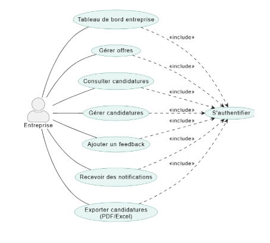

<em>Figure 10 : Diagramme de cas d'utilisation espace entreprise</em>

**Espace Administrateur :** 

<em>Figure 11 : Diagramme de cas d'utilisation admin</em>

#### Diagramme de cas d’utilisation globale : Mobile
Le diagramme de cas d'utilisation mobile cartographie les fonctionnalités majeures de StageFlow adaptées aux téléphones. Il illustre de manière synthétique comment les acteurs interagissent avec l'application pour un usage nomade et fluide. 

<em>Figure 12 : Diagramme de cas d'utilisation Mobile</em>

### Diagramme de cas d’utilisation sprint 1

#### Sprint 1 : Web
Ce premier sprint correspond au MVP de Stage Flow. Il met en place les fonctionnalités essentielles permettant aux étudiants de consulter et postuler aux offres de stage, aux entreprises de publier et gérer leurs offres et candidatures, et à l’administrateur de gérer les comptes utilisateurs de manière sécurisée et modérer les feedbacks.

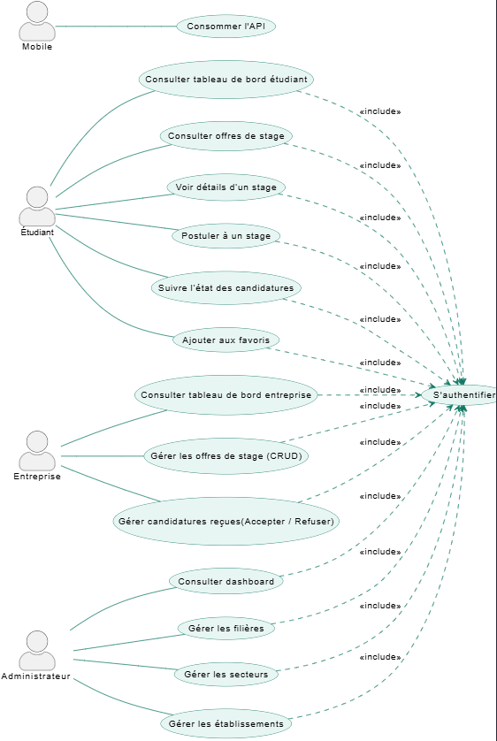

<em>Figure 13 : Diagramme de cas d'utilisation sprint 1 web</em>

Ce sprint établit ainsi le fonctionnement de base de la plateforme avant l’ajout des fonctionnalités avancées.

#### Sprint 1 : Mobile
Ce premier sprint de l’application mobile met en place les fonctionnalités essentielles destinées aux étudiants. Il permet de consulter la page d’accueil, d’accéder au tableau de bord, de visualiser les offres de stage ainsi que les candidatures soumises. Les données affichées dans l’application mobile sont fournies par l’API développée dans la plateforme web.

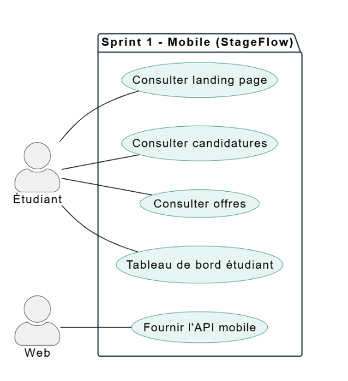

<em>Figure 14 : Diagramme de cas d'utilisation sprint 1 Mobile</em>

Ce sprint établit ainsi les fonctionnalités de base de l’application mobile, avant l’intégration des fonctionnalités avancées et des interactions en temps réel. 

### Diagramme de cas d’utilisation sprint 2

#### Sprint 2 : Web
Ce deuxième sprint introduit les fonctionnalités avancées de la plateforme StageFlow, visant à améliorer l’expérience des différents acteurs du système. Il permet aux étudiants et aux entreprises de recevoir des notifications afin de suivre en temps réel les activités et les mises à jour importantes. De plus, les entreprises disposent de la possibilité d’exporter les candidatures au format PDF ou Excel pour faciliter leur gestion et leur analyse.

Par ailleurs, l’administrateur bénéficie de fonctionnalités de supervision avancées, notamment la consultation de statistiques détaillées et l’export des données des utilisateurs.

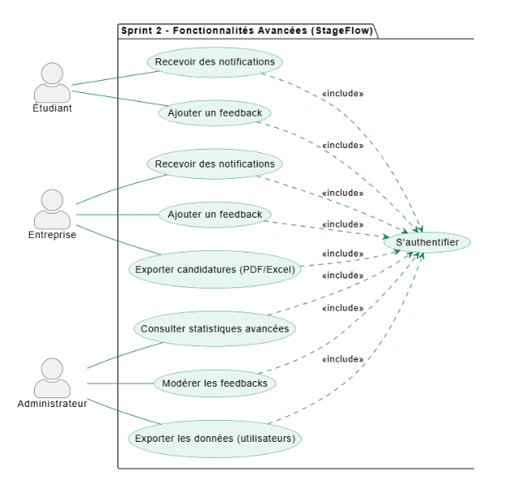

<em>Figure 15 : Diagramme de cas d'utilisation sprint 2 web</em>

Ce sprint renforce ainsi les capacités de gestion et de suivi de la plateforme tout en améliorant la communication entre les différents acteurs. 

#### Sprint 2 : Mobile
Ce deuxième sprint de l’application mobile apporte des fonctionnalités supplémentaires visant à enrichir l’expérience utilisateur des étudiants. Il permet notamment d’ajouter des offres aux favoris afin de les retrouver facilement, ainsi que de consulter le profil utilisateur directement depuis l’application. L’accès à ces fonctionnalités est sécurisé à travers un système d’authentification.

Ce sprint repose également sur une intégration avec le backend web via une API dédiée, garantissant la synchronisation et la continuité des données entre les deux plateformes. 

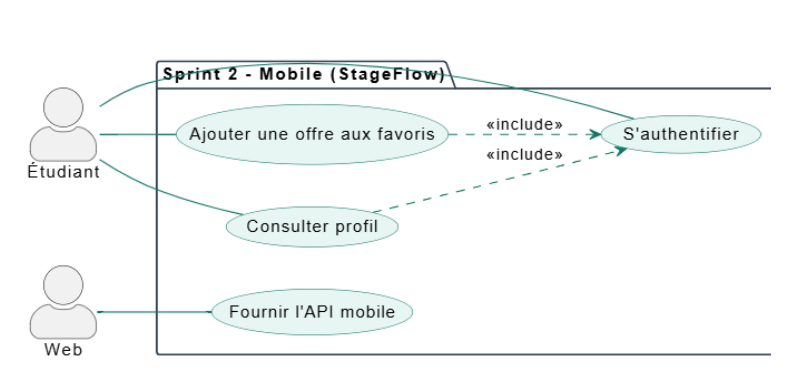

<em>Figure 16 : Diagramme de cas d'utilisation sprint 2 Mobile</em>

Ce sprint a pour objectif d’enrichir l’application mobile avec des fonctionnalités essentielles tout en assurant une synchronisation sécurisée et fluide des données avec le backend web via une API. 

---

### Diagramme de cas d’utilisation sprint 3

Ce troisième sprint introduit un Assistant Virtuel (Chatbot) afin d'offrir une assistance instantanée sur StageFlow. Il permet aux étudiants, entreprises et visiteurs de poser une question et de recevoir une réponse automatique. Pour les utilisateurs enregistrés, l'accès à ces fonctionnalités inclut l'étape obligatoire de s'authentifier. 

<em>Figure 17 : Diagramme de cas d'utilisation sprint 3</em>

Ce sprint établit ainsi les fonctionnalités de base de l’application mobile, avant l’intégration des fonctionnalités avancées et des interactions en temps réel. 

---

## Branche technique

Cette branche technique présente de manière synthétique les choix technologiques et l’architecture adoptés pour le développement du projet. Elle regroupe les principaux outils utilisés côté backend et frontend, ainsi que la base de données, tout en mettant en avant l’organisation générale de l’application selon une architecture structurée et cohérente. Elle introduit également la phase de conception, qui permet de modéliser les entités du système et de préparer la structure globale du projet avant le développement. 

### Choix technologiques

Pour la réalisation de StageFlow, plusieurs technologies ont été sélectionnées afin de garantir la performance, la sécurité, la maintenabilité et la rapidité de développement. 

**🔹 Technologies Backend**
- **PHP 8+ / Laravel 12 :** technologies utilisées pour développer le backend de l’application selon l’architecture MVC, en assurant une structure claire.
- **Native PHP :** solution permettant de transformer l’application Laravel en application mobile Android (APK).
- **Spatie Laravel Permission :** package dédié à la gestion des rôles et des permissions (administrateur, étudiant, entreprise).

**🔹 Technologies Frontend**
- **Blade Templates :** moteur de templates de Laravel pour générer des interfaces dynamiques et réutilisables.
- **Tailwind CSS & Preline :** outils utilisés pour concevoir une interface moderne et responsive.
- **Alpine.js :** bibliothèque JavaScript légère permettant d’ajouter des interactions dynamiques sans complexité.

**🔹 Base de données**
- **MySQL :** système de gestion de base de données relationnelle utilisé pour stocker les informations de l’application.

**🔹 Outils externes**
- **Tiptap :** éditeur de texte riche permettant la création et la mise en forme avancée du contenu. 
- **Vite :** outil de compilation et d’optimisation des ressources frontend. 

**🔹 Outils de modélisation et de documentation**
- **Mermaid :** outil permettant de générer des schémas et diagrammes à partir d’une syntaxe textuelle simple.
- **PlantUML :** solution utilisée pour concevoir les différents diagrammes UML nécessaires à l’analyse et à la documentation du système.

En résumé, cette stack technique moderne et cohérente garantit à StageFlow une base robuste, performante et évolutive, parfaitement optimisée pour un développement rapide et une expérience utilisateur fluide. 

### Architecture de projet 

Le projet StageFlow repose sur une architecture structurée combinant le modèle MVC, l’architecture 3-tiers et une architecture globale intégrant l’application web, l’API et l’application mobile développée avec NativePHP. Cette organisation facilite la maintenance et l’évolution du système. 

**1. Architecture MVC et 3-Tiers**  
L’application Stage Flow est développée avec Laravel en suivant le modèle MVC (Model–View–Controller) et une architecture en trois couches :
- **Couche Présentation :** interfaces web réalisées avec Blade, Tailwind CSS, Preline et Alpine.js, ainsi que l’application mobile générée avec NativePHP.
- **Couche Métier :** logique applicative, validation des données et gestion des rôles et permissions via Spatie Laravel Permission.
- **Couche Données :** modèles Eloquent et base de données MySQL.

Cette organisation assure une séparation claire des responsabilités, facilite la maintenance et améliore l’évolutivité du système.

**2. Architecture globale**  
Le système repose sur une architecture centralisée dans laquelle l’application web, l’API REST et l’application mobile développée avec NativePHP partagent la même logique métier et la même base de données.
Cette approche garantit la cohérence des fonctionnalités sur toutes les plateformes et simplifie l’évolution de l’application.

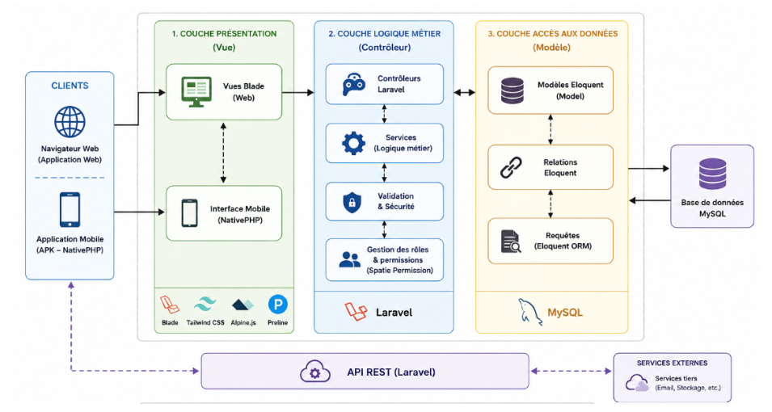

<em>Figure 18 : Architecture globale de projet</em>

En résumé, cette architecture hybride et centralisée garantit une séparation claire des responsabilités et une cohérence totale entre le web et le mobile, assurant ainsi la pérennité, la sécurité et la maintenabilité de StageFlow. 

### Prototype (Fonctionnalités, Classes)

Avant de commencer le développement de StageFlow, j'ai réalisé un **projet technique** servant de prototype : une **application de gestion et de filtrage de films**, développée avec la stack technologique cible (Laravel, Tailwind CSS, Preline UI, Alpine.js, Spatie, AJAX, API, NativePHP). Ce projet a été construit en 8 versions progressives pour maîtriser chaque brique technologique avant le projet principal.

**Fonctionnalités clés :**
- **Visiteur :** Navigation sur la page d'accueil, recherche et consultation des détails des films.
- **Admin :** Gestion complète (CRUD) des films et des catégories, filtrage et recherche dynamique.

**Classes principales du modèle :**
- **Film :** `{id, titre, description, directeur, image}`
- **Categorie :** `{id, nom}`
- **User :** `{id, nom, email, mot_de_passe}`

**Relations principales :**
- **Film <-> Categorie :** Relation Many-to-Many (plusieurs-à-plusieurs).
- **User <-> Film :** Relation One-to-Many (un-à-plusieurs, créateur du film).

### Conception

Dans la phase de conception, nous avons défini la structure fonctionnelle et technique de StageFlow avant de commencer le développement. Cette étape comprend la réalisation du diagramme de classes UML afin de modéliser les principales entités du système, telles que les utilisateurs, les offres de stage, les candidatures et les favoris, ainsi que les relations entre elles. Elle inclut également la création des maquettes des interfaces pour visualiser l’organisation des pages et les principales fonctionnalités de la plateforme. Cette phase a permis d’établir une vision claire du projet et de préparer une base solide pour l’implémentation. 

#### Diagramme de classe

Le diagramme de classes représente la structure interne de l’application StageFlow et illustre les différentes entités du système ainsi que les relations entre elles. Il met en évidence les classes principales telles que Utilisateur, Étudiant, Entreprise et Administrateur, qui représentent les différents acteurs de la plateforme.

Il structure l'application StageFlow en reliant ses acteurs (Étudiant, Entreprise, Administrateur) à ses fonctionnalités clés. Il modélise ainsi la publication des offres, la gestion des candidatures, les interactions (feedbacks, favoris, notifications) et le contrôle des accès via les rôles et permissions. 

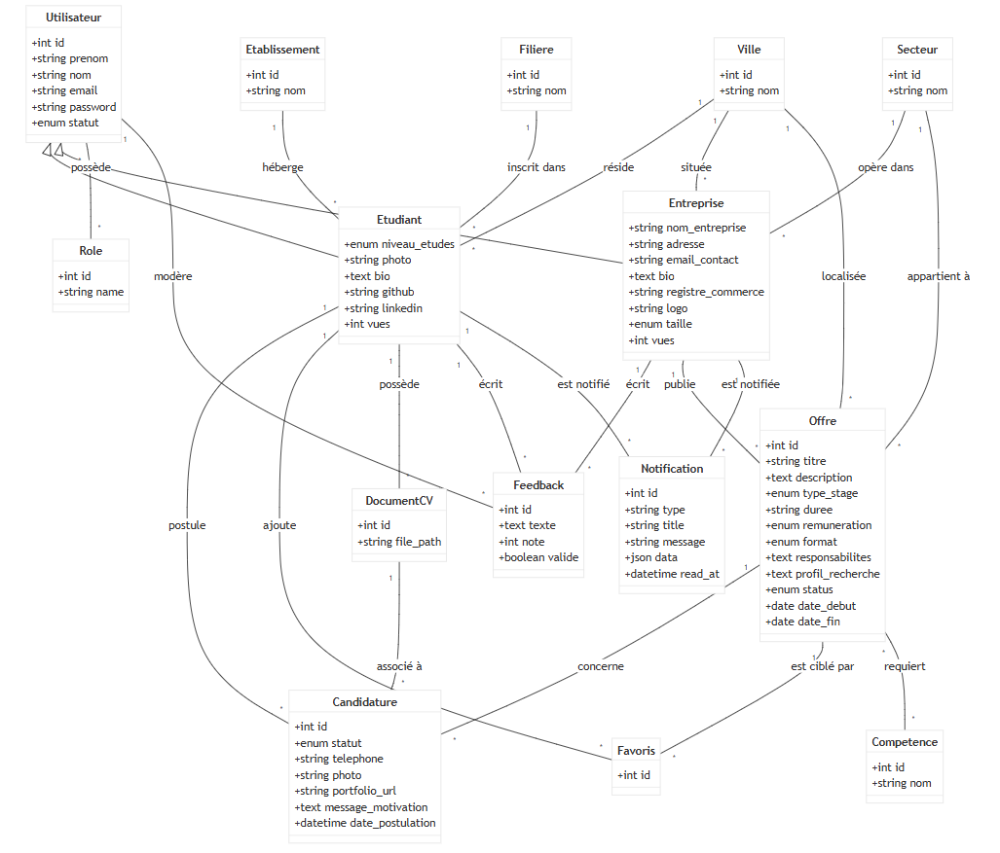

<em>Figure 19 : Diagramme de classe</em>

En résumé, ce diagramme de classes fournit une cartographie précise de la base de données de StageFlow, garantissant une structure relationnelle robuste et cohérente pour soutenir toutes les fonctionnalités de la plateforme. 

#### Charte graphique 

La charte graphique de StageFlow définit l’identité visuelle de la plateforme afin d’assurer une interface cohérente, moderne et agréable à utiliser. Elle repose sur une palette de couleurs principalement basée sur l’indigo, reflétant la confiance et le professionnalisme. La typographie utilise des polices modernes et lisibles pour améliorer l’expérience utilisateur.

Cette charte intègre également un ensemble de composants UI standardisés (boutons, badges, états) permettant d’uniformiser les interfaces et de garantir une meilleure ergonomie sur l’ensemble de la plateforme web et mobile.

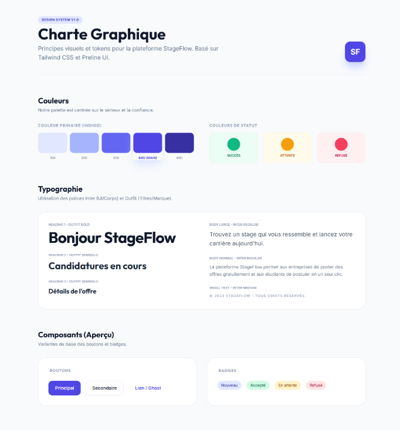

<em>Figure 20 : Charte graphique</em>

En conclusion, cette charte graphique assure à StageFlow une identité visuelle cohérente, moderne et professionnelle, garantissant une expérience utilisateur fluide et uniforme sur toutes les interfaces. 

#### Maquettes

Les maquettes de l’application Stage Flow présentent une interface simple et intuitive destinée aux étudiants, aux entreprises et à l’administrateur. Elles permettent de visualiser clairement les principales fonctionnalités de la plateforme, notamment la consultation des offres de stage, le suivi des candidatures, la gestion des profils et la supervision des utilisateurs. Ces interfaces ont été conçues afin de garantir une expérience utilisateur fluide et une navigation facile sur la plateforme web et mobile. 

**Maquette 1 : Landing page**  
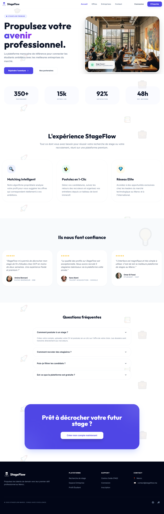

<em>Figure 21 : Maquette Landing page</em>

**Maquette 2 : Tableau de bord étudiant**  
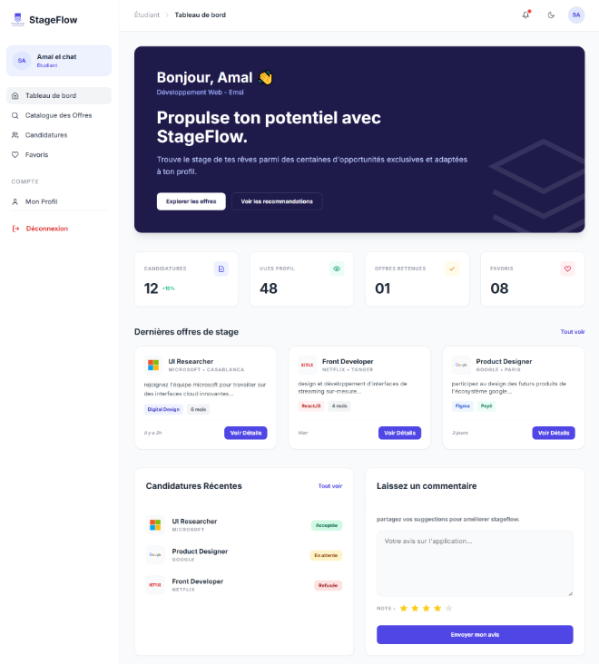

<em>Figure 22 : Maquette Tableau de bord étudiant</em>

**Maquette 3 : Tableau de bord entreprise**  
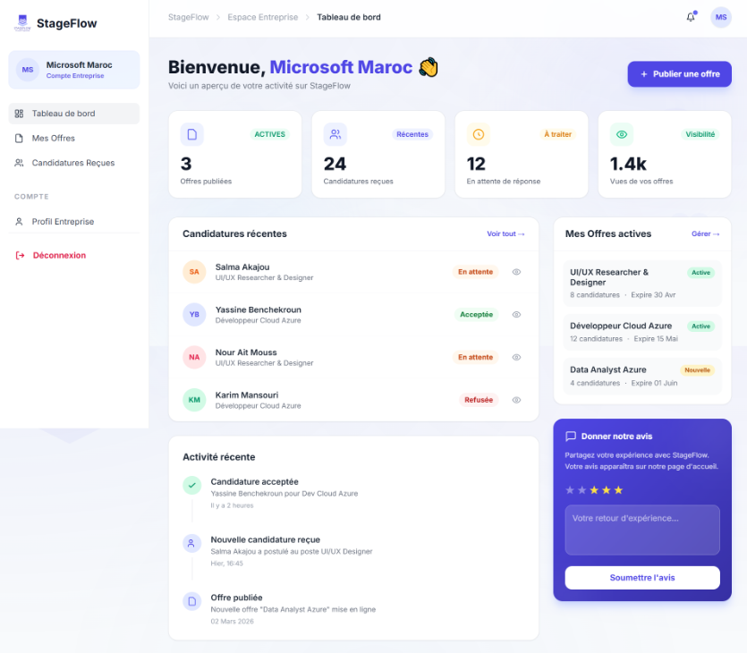

<em>Figure 23 : Maquette Tableau de bord entreprise</em>

**Maquette 4 : Tableau de bord administrateur**  
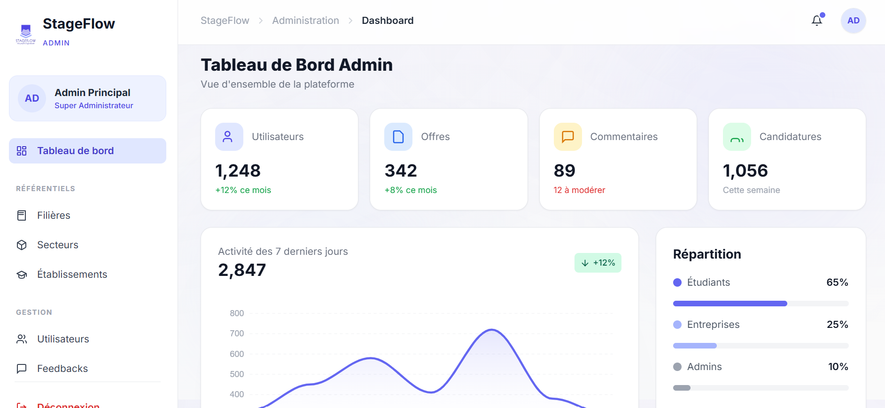

<em>Figure 24 : Maquette Tableau de bord administrateur</em>

**Maquettes Mobile :**  
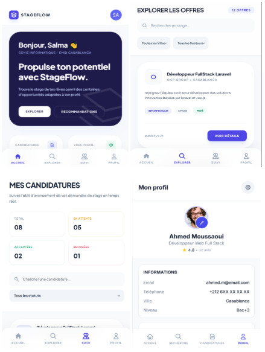

<em>Figure 25 : Maquette de l'application mobile</em>

En conclusion, ces maquettes illustrent l’interface de l’application Stage Flow sur web et mobile et donnent un aperçu global de l’organisation des écrans et de la navigation.

---

## Réalisation

La phase de réalisation constitue l’étape durant laquelle les maquettes et les spécifications définies lors de la conception sont transformées en une application fonctionnelle. Dans le cadre du projet Stage Flow, cette étape a consisté au développement de la plateforme web et mobile, en mettant en œuvre les différentes fonctionnalités liées à la gestion des stages, des candidatures et des utilisateurs. Elle a également impliqué l’intégration des technologies choisies, le respect de l’architecture du système ainsi que l’application des bonnes pratiques de développement afin de garantir une application stable, cohérente et facile à utiliser. 

### Interfaces

Cette section présente l'ensemble des interfaces graphiques de la plateforme StageFlow, développées et codées au fil des différents sprints. Conçues pour être modernes, ergonomiques et entièrement responsives, ces pages concrétisent visuellement l'ensemble des fonctionnalités et des parcours utilisateurs du système.
 
**Interfaces Web Sprint 1 :**  
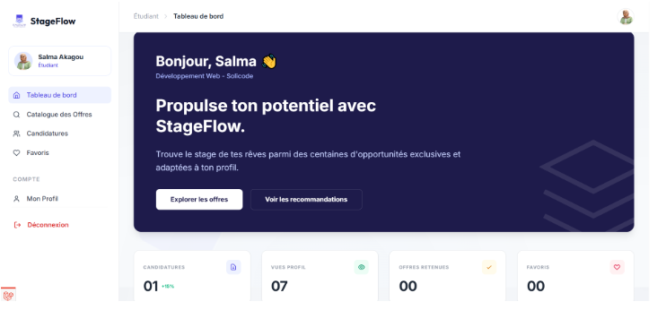

<em>Figure 26 : Interface Tableau de bord étudiant</em>

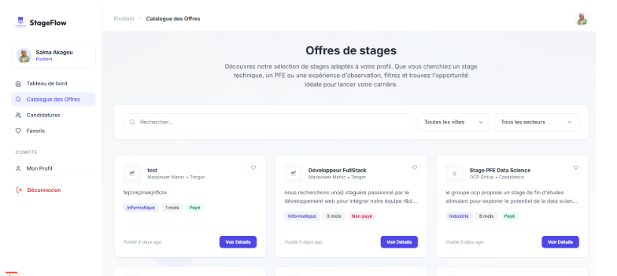

<em>Figure 27 : Interface Liste des offres</em>

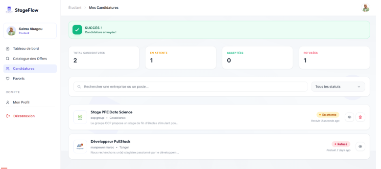

<em>Figure 28 : Interface Candidatures étudiant</em>

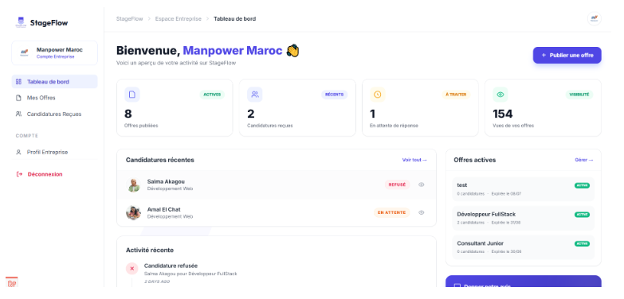

<em>Figure 29 : Interface Tableau de bord entreprise</em>

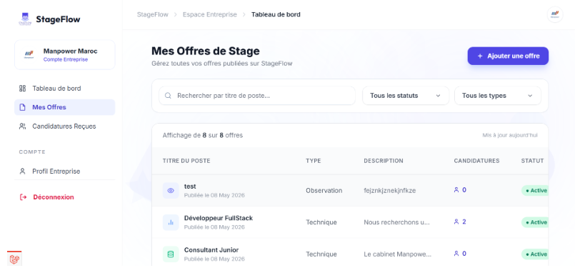

<em>Figure 30 : Interface Gestion des offres</em>

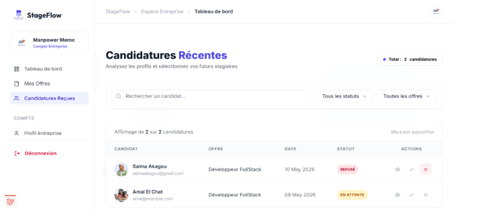

<em>Figure 31 : Interface Candidatures reçues</em>

**Interfaces Mobile Sprint 1 :**

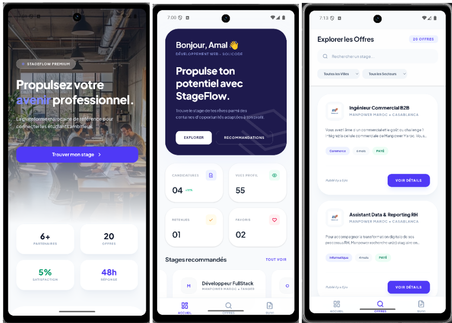

<em>Figure 32 : Interfaces de l'application mobile</em>

**Interfaces Sprint 2 :**  

---

## Conclusion

Ce projet de fin d’études a permis de concevoir et de développer Stage Flow, une plateforme web et mobile dédiée à la gestion des stages. Cette solution facilite la recherche de stages pour les étudiants, simplifie la gestion des candidatures pour les entreprises et fournit à l’administrateur des outils de supervision et de contrôle.

La réalisation de ce projet s’est appuyée sur les méthodologies Design Thinking, 2TUP et Scrum, qui ont permis d’identifier les besoins des utilisateurs, de structurer la conception et d’organiser le développement de manière progressive en deux sprints.

Ce travail a constitué une expérience très enrichissante, me permettant de consolider mes compétences en développement web et mobile, en modélisation UML, en conception de bases de données et en gestion de projet. Il m’a également permis de renforcer mon autonomie, mon sens de l’organisation et ma capacité à concevoir une solution répondant à des besoins concrets.