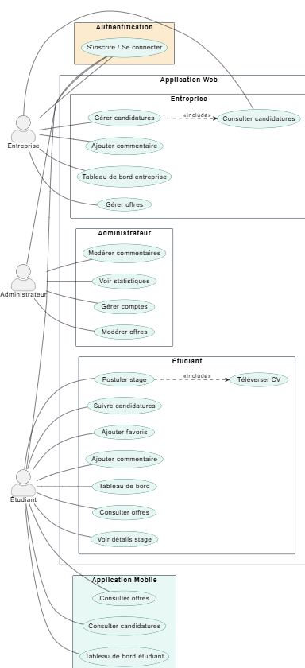
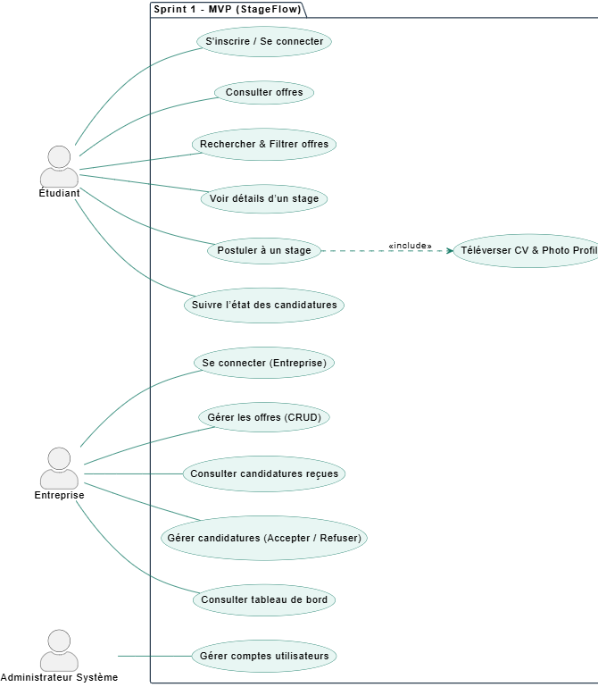
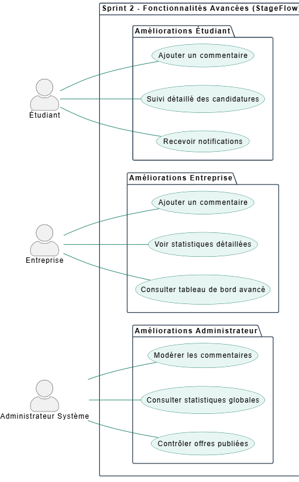

# Rapport de Projet de Fin de Formation  
## Stage Flow : Développement d’une Solution en ligne pour la recherche et gestion des stages 
### Formation de Développement Mobile – Mode Bootcamp  

---

**Réalisée par :** Salma Akajou  
**Encadré par :** Mr. Essarraj Fouad  

**Année de Formation :** 2025/2026  

---

# Table des matières

1. [Liste des figures](#liste-des-figures)  
2. [Remerciement](#remerciement)  
3. [Introduction](#introduction)  
4. [Contexte de projet](#contexte-de-projet)  
5. [Objectif de Project](#objectif-de-project)  
6. [Cahier de charge](#cahier-de-charge)  
7. [Méthode de travail](#méthode-de-travail)  
8. [Scrum](#scrum)  
9. [La méthodologie 2TUP](#la-méthodologie-2tup)  
10. [Design Thinking](#design-thinking)  
11. [Branche fonctionnelle](#branche-fonctionnelle)  
12. [Carte d’empathie](#carte-dempathie)  
13. [Définition de problème](#définition-de-problème)  
14. [Diagramme de cas d’utilisation générale](#diagramme-de-cas-dutilisation-générale)  
15. [Diagramme de cas d’utilisation Sprint 1](#diagramme-de-cas-dutilisation-sprint-1)  
16. [Diagramme de cas d’utilisation Sprint 2](#diagramme-de-cas-dutilisation-sprint-2)  
17. [Branche technique](#branche-technique)  
18. [Choix technologiques](#choix-technologiques)  
19. [Architecture de projet](#architecture-de-projet)  
20. [Prototype (Fonctionnalités, Classes)](#prototype-fonctionnalités-classes)  
21. [Conception](#conception)  
22. [Diagramme de classe](#diagramme-de-classe)  
23. [Maquettes](#maquettes)  
24. [Charte graphique](#charte-graphique)  
25. [Réalisation](#réalisation)  
26. [Interfaces](#interfaces)  
27. [Conclusion](#conclusion)  

---

# Liste des figures

. 

---

# Remerciement

.  

---

# Introduction

La recherche de stage constitue une étape essentielle dans le parcours des étudiants en formation supérieure, permettant de mettre en pratique les compétences acquises et de préparer l’insertion professionnelle. Cependant, de nombreux étudiants rencontrent des difficultés pour trouver des stages adaptés à leur profil, en raison de la dispersion des offres, d’informations souvent incomplètes et d’un suivi des candidatures complexe.
De leur côté, les entreprises éprouvent des difficultés à gérer efficacement les candidatures et à identifier rapidement les profils correspondant à leurs besoins. Face à ce constat, le projet StageFlow vise à centraliser les offres de stages et à faciliter la mise en relation entre étudiants et entreprises, afin de rendre le processus de recherche et de gestion des stages plus simple, clair et efficace. 

---

# Contexte de projet

Dans le cadre de ma formation en développement web, nous devons réaliser un projet de fin de formation qui reflète nos compétences et répond à un besoin réel. En discutant avec mes collègues et en observant les difficultés rencontrées par les étudiants de mon établissement, j’ai constaté que beaucoup avaient du mal à trouver un stage correspondant à leur profil.
Les offres étaient dispersées sur plusieurs sites et réseaux sociaux, et il était difficile de suivre l’état des candidatures. Cette situation a inspiré l’idée du projet Stage Flow, une application web visant à centraliser les offres de stages, simplifier la recherche pour les étudiants et faciliter la gestion des candidatures pour les entreprises.

---

# Objectif de Project

.

---

# Cahier de charge

## Description :
StageFlow est une plateforme web centralisée qui permet aux étudiants de rechercher, consulter et postuler aux offres de stage, et aux entreprises de publier et gérer leurs offres et candidatures facilement.  

## Objectifs principaux
- Centraliser la recherche et la gestion des stages.  
- Simplifier la candidature pour les étudiants et le suivi des candidatures.  
- Permettre aux entreprises de gérer efficacement leurs offres et candidats.  
- Fournir des statistiques fiables pour améliorer la prise de décision.  

## Utilisateurs et rôles
1. **Étudiant** : consulter les offres, postuler et suivre ses candidatures.  
2. **Entreprise / Admin** : publier, modifier, supprimer les offres, examiner les candidatures, suivre les statistiques.  

## Fonctionnalités clés
- Création de compte et authentification.  
- Recherche et filtrage des offres par domaine, durée et entreprise.  
- Suivi des candidatures pour les étudiants.  
- Gestion complète des offres et candidatures pour les entreprises.  
- Tableau de bord et statistiques pour les entreprises.  
- Notifications pour les réponses et nouvelles offres.  

## Contraintes
- Interface simple et intuitive.  
- Compatible mobile et ordinateur.  
- Accès sécurisé selon le rôle utilisateur.  

## Critères de réussite
- Étudiants capables de trouver et postuler facilement.  
- Entreprises pouvant gérer leurs offres correctement.  
- Suivi des candidatures et notifications fonctionnelles.  
- Statistiques lisibles et précises.  
- Fonctionnalités des deux sprints implémentées et testées.

---

# Méthode de travail

---

# Scrum

La méthodologie Scrum est une méthodologie agile qui permet de gérer un projet de manière flexible et collaborative, en favorisant la livraison progressive de fonctionnalités. Elle repose sur l’itération, la priorisation des tâches et la communication régulière entre les membres de l’équipe.  

Dans le cadre de ce projet, nous avons organisé le travail selon les principes de Scrum, ce qui nous a permis de mieux planifier, suivre et livrer les différentes fonctionnalités du blog de manière efficace.  

## Principes clés

- **Transparence :** Toutes les tâches et objectifs sont visibles par l’équipe.  
- **Inspection :** Chaque sprint est évalué pour détecter les améliorations possibles.  
- **Adaptation :** L’équipe ajuste le plan de travail selon les résultats des sprints précédents.  

---

# La méthodologie 2TUP

## Introduction
La méthodologie **2TUP (Two-Tracks Unified Process)** est un processus de développement logiciel qui s’appuie sur une structure en forme de Y. Elle permet de séparer, puis de réunir, deux dimensions essentielles d’un projet :
- **l’analyse fonctionnelle** (ce que doit faire le système)
- **la conception technique** (comment le réaliser)
Cette approche facilite une meilleure organisation du travail et garantit une compréhension claire des besoins avant la phase de développement. Le 2TUP est également **itératif et incrémental**, ce qui permet d’avancer progressivement avec des versions successives du produit.
## Principes clés du 2TUP
La méthode repose sur plusieurs fondements importants :
- **Itératif et incrémental** : le développement se fait par cycles, en ajoutant des fonctionnalités au fur et à mesure.
- **Piloté par les risques** : les éléments les plus critiques sont traités dès le début du projet.
- **Séparation fonctionnel / technique** : cela évite les confusions et permet une meilleure organisation du travail.
- **Architecture solide** : une base technique fiable est élaborée tôt dans le processus.
- **Collaboration continue** : les utilisateurs sont impliqués régulièrement pour valider les besoins.
## La structure en Y
Le 2TUP est représenté par un schéma en Y, qui reflète les trois grandes étapes du processus :
- **1- Phase initiale : Capture des besoins**

Cette phase consiste à comprendre les objectifs du projet, identifier les acteurs, et préciser les exigences globales.
- **2- Branche fonctionnelle (haut du Y)**

 Elle vise à analyser ce que doit faire le système : cas d’usage, processus métier, workflows, scénarios utilisateurs.
- **3- Branche technique (bas du Y)**

 Elle concerne la manière dont la solution sera construite : architecture, technologies, base de données, API, composants techniques.
- **4- Phase de convergence**
 Les deux branches se rejoignent pour lancer le développement, les tests, l’intégration et la livraison.

---

# Design Thinking

 

## Qu’est-ce que le Design Thinking ?
Le **Design Thinking** est une approche de résolution de problèmes centrée sur l’humain.
Elle vise à comprendre les besoins réels des utilisateurs pour créer des solutions innovantes.
Très utilisée dans le design, la technologie, l’éducation, l’innovation et les services.
## Pourquoi utiliser le Design Thinking ?
- Encourage la créativité et l’innovation
- Permet de développer des solutions réellement adaptées aux besoins des utilisateurs
- Favorise la collaboration entre équipes
- Utile pour résoudre des problèmes complexes ou mal définis
## Les 5 étapes du Design Thinking
1. **Empathie (Empathize)**:
Comprendre l’utilisateur : observer, interviewer, analyser
Objectif : découvrir ses besoins, ses motivations et ses difficultés
2. **Définition du problème (Define)**:
Regrouper et analyser les informations collectées
Formuler un problème clair et centré sur l’utilisateur
Exemple : « Comment pourrions-nous aider l’utilisateur à… ? »
3. **Idéation (Ideate)**:
-Générer un maximum d’idées sans jugement
-Utiliser des techniques comme le brainstorming, le mind mapping, ou les questions « Comment pourrions-nous ? »
-Encourager la créativité et les points de vue variés
4. **Prototype**:
- Créer des versions simplifiées ou maquettes des idées sélectionnées
- Peut être un dessin, un modèle, une interface simple, un scénario, etc.
- Objectif : expérimenter rapidement
5. **Test**:
- Tester les prototypes auprès des utilisateurs
- Recueillir leurs commentaires
- Améliorer, ajuster ou repenser la solution

---

# Branche fonctionnelle

## Carte d'empathie
**Apprenant :**

 

**Entreprise :**

 

**Administrateur :**

 

---

# Définition de problème

# Définition du Problème – StageFlow

Même avec la motivation des étudiants et des entreprises, plusieurs obstacles freinent la gestion efficace des stages. L’analyse met en évidence les difficultés principales suivantes :

**Offres dispersées :** Les stages sont éparpillés sur plusieurs plateformes et réseaux, rendant difficile pour les étudiants d’avoir une vue d’ensemble.  

**Suivi compliqué des candidatures :** Les étudiants n’ont pas de moyen clair pour suivre l’état de leurs candidatures, générant stress et perte de temps.  

**Organisation difficile pour les entreprises :** La réception et le tri des candidatures via emails ou réseaux sociaux sont longs et désordonnés.  

**Manque de visibilité :** Les entreprises disposent de peu d’outils pour analyser les candidatures et obtenir des statistiques fiables.

---

# Diagramme de cas d’utilisation générale

Le diagramme de cas d’utilisation de notre application StageFlow illustre les principales fonctionnalités accessibles aux trois acteurs du système : l’étudiant, l’entreprise et l’administrateur. Il présente les actions disponibles pour chaque rôle, telles que la consultation et la candidature aux offres de stage pour les étudiants, la publication et la gestion des offres et candidatures pour les entreprises, ainsi que la gestion des comptes, le contrôle des offres et la consultation des statistiques pour l’administrateur. Ce diagramme permet de visualiser l’organisation fonctionnelle globale de la plateforme et de comprendre les interactions entre les utilisateurs et le système avant la phase de développement.

 

---

# Diagramme de cas d’utilisation Sprint 1
- Ce premier sprint correspond au MVP de StageFlow.  
- Il met en place les fonctionnalités essentielles permettant aux étudiants de consulter et postuler aux offres de stage, aux entreprises de publier et gérer leurs offres et candidatures, et à l’administrateur de gérer les comptes utilisateurs de manière sécurisée.

 

- Ce sprint établit ainsi le fonctionnement de base de la plateforme avant l’ajout des fonctionnalités avancées.

---

# Diagramme de cas d’utilisation Sprint 2
- Ce deuxième sprint introduit les fonctionnalités avancées de StageFlow.  
- Il améliore l’expérience utilisateur en ajoutant un suivi plus détaillé des candidatures et des notifications pour les étudiants, un tableau de bord avancé et des statistiques pour les entreprises, ainsi que le contrôle des offres publiées et la consultation des statistiques globales pour l’administrateur.
 

- Ce sprint permet ainsi d’optimiser la gestion des stages et d’offrir une vision plus complète et structurée du processus.

---

# Branche technique

. 

---

# Choix technologiques

.

---

# Architecture de projet

.

---

# Prototype (Fonctionnalités, Classes)

.

---

# Conception

.

---

# Diagramme de classe

.

---

# Maquettes

.

---

# Charte graphique

.

---

# Réalisation

.

---

# Interfaces

.

---

# Conclusion

.