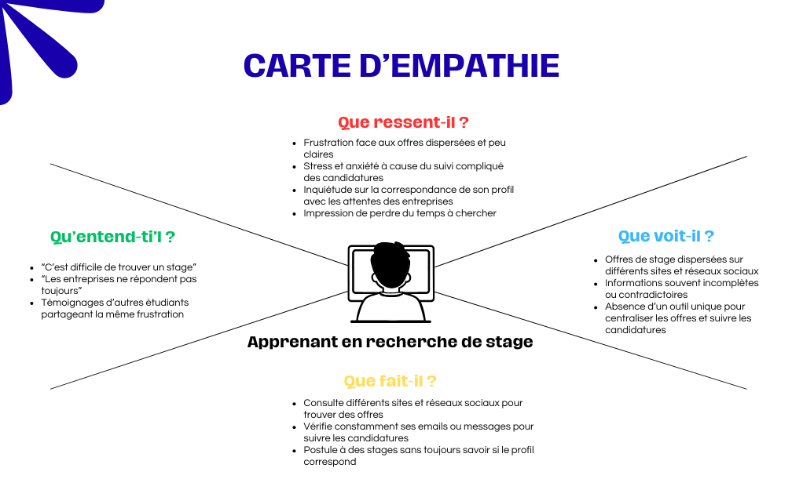
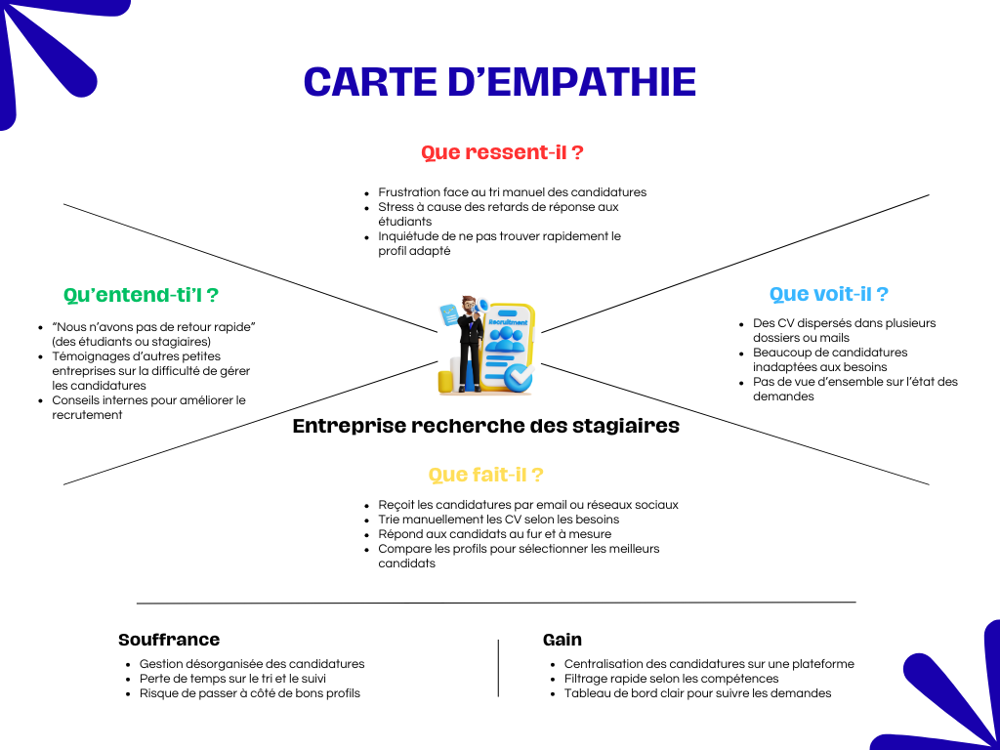
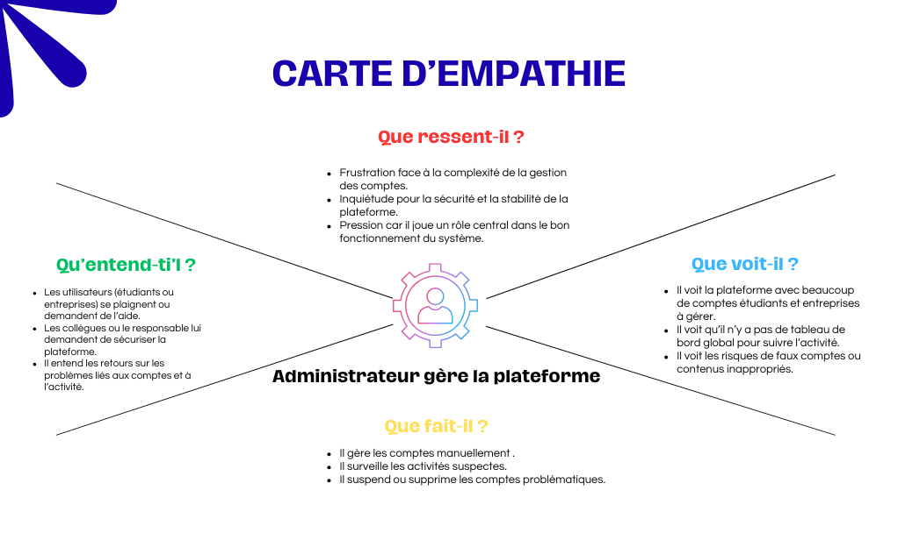
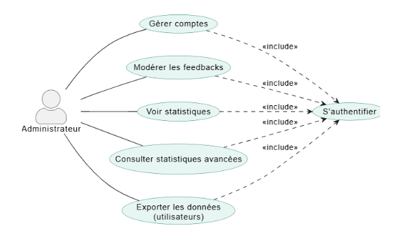
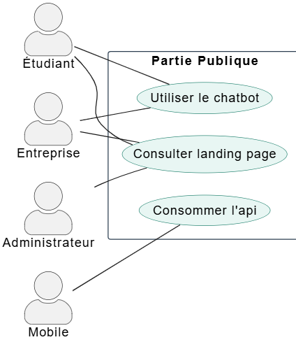
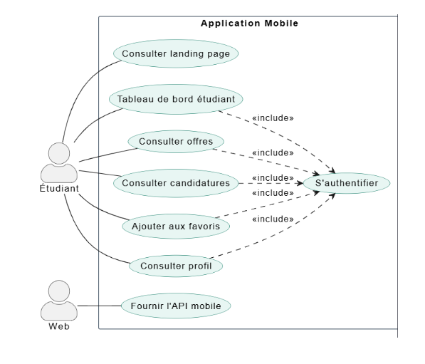
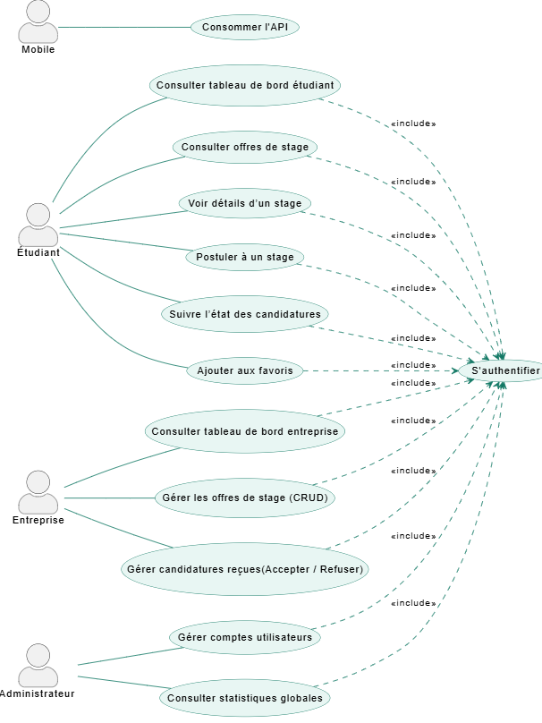
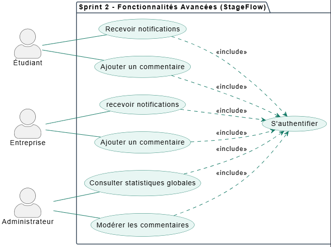

# Rapport de Projet de Fin de Formation  
## Stage Flow : Développement d’une Solution en ligne pour la recherche et gestion des stages 
### Formation de Développement Mobile – Mode Bootcamp  

---

**Réalisée par :** Salma Akajou  
**Encadré par :** Mr. Essarraj Fouad  

**Année de Formation :** 2025/2026  

---

# Table des matières

1. [Liste des figures](#liste-des-figures)  
2. [Remerciement](#remerciement)  
3. [Introduction](#introduction)  
4. [Contexte de projet](#contexte-de-projet)  
5. [Objectif de Project](#objectif-de-project)  
6. [Cahier de charge](#cahier-de-charge)  
7. [Méthode de travail](#méthode-de-travail)  
8. [Scrum](#scrum)  
9. [La méthodologie 2TUP](#la-méthodologie-2tup)  
10. [Design Thinking](#design-thinking)  
11. [Branche fonctionnelle](#branche-fonctionnelle)  
12. [Carte d’empathie](#carte-dempathie)  
13. [Définition de problème](#définition-de-problème)  
14. [Diagramme de cas d’utilisation générale](#diagramme-de-cas-dutilisation-générale)  
15. [Diagramme de cas d’utilisation Sprint 1](#diagramme-de-cas-dutilisation-sprint-1)  
16. [Diagramme de cas d’utilisation Sprint 2](#diagramme-de-cas-dutilisation-sprint-2)  
17. [Branche technique](#branche-technique)  
18. [Choix technologiques](#choix-technologiques)  
19. [Architecture de projet](#architecture-de-projet)  
20. [Prototype (Fonctionnalités, Classes)](#prototype-fonctionnalités-classes)  
21. [Conception](#conception)  
22. [Diagramme de classe](#diagramme-de-classe)  
23. [Maquettes](#maquettes)  
24. [Charte graphique](#charte-graphique)  
25. [Réalisation](#réalisation)  
26. [Interfaces](#interfaces)  
27. [Conclusion](#conclusion)  

---

# Introduction

La recherche de stage constitue une étape essentielle dans le parcours des étudiants en formation supérieure, permettant de mettre en pratique les compétences acquises et de préparer l’insertion professionnelle. Cependant, de nombreux étudiants rencontrent des difficultés pour trouver des stages adaptés à leur profil, en raison de la dispersion des offres, d’informations souvent incomplètes et d’un suivi des candidatures complexe.
De leur côté, les entreprises éprouvent des difficultés à gérer efficacement les candidatures et à identifier rapidement les profils correspondant à leurs besoins. Face à ce constat, le projet StageFlow vise à centraliser les offres de stages et à faciliter la mise en relation entre étudiants et entreprises, afin de rendre le processus de recherche et de gestion des stages plus simple, clair et efficace. 

---

# Contexte de projet

Dans le cadre de ma formation en développement web, nous devons réaliser un projet de fin de formation qui reflète nos compétences et répond à un besoin réel. En discutant avec mes collègues et en observant les difficultés rencontrées par les étudiants de mon établissement, j’ai constaté que beaucoup avaient du mal à trouver un stage correspondant à leur profil.
Les offres étaient dispersées sur plusieurs sites et réseaux sociaux, et il était difficile de suivre l’état des candidatures. Cette situation a inspiré l’idée du projet Stage Flow, une application web visant à centraliser les offres de stages, simplifier la recherche pour les étudiants et faciliter la gestion des candidatures pour les entreprises.

---

# Cahier de charge

## Description :
StageFlow est une plateforme web centralisée qui permet aux étudiants de rechercher, consulter et postuler aux offres de stage, et aux entreprises de publier et gérer leurs offres et candidatures facilement.  

## Objectifs principaux
- Centraliser la recherche et la gestion des stages.  
- Simplifier la candidature pour les étudiants et le suivi des candidatures.  
- Permettre aux entreprises de gérer efficacement leurs offres et candidats.  
- Fournir des statistiques fiables pour améliorer la prise de décision.  

## Utilisateurs et rôles
1. **Étudiant** : consulter les offres, postuler et suivre ses candidatures.  
2. **Entreprise / Admin** : publier, modifier, supprimer les offres, examiner les candidatures, suivre les statistiques.  
3. **Admin** : Gérer les utilisateurs, Moderer les commentaires.  

## Fonctionnalités clés
- Création de compte et authentification.  
- Recherche et filtrage des offres par domaine, durée et entreprise.  
- Suivi des candidatures pour les étudiants.  
- Gestion complète des offres et candidatures pour les entreprises.  
- Tableau de bord et statistiques pour les entreprises.  
- Notifications pour les réponses et nouvelles offres.  

## Contraintes
- Interface simple et intuitive.  
- Compatible mobile et ordinateur.  
- Accès sécurisé selon le rôle utilisateur.  

## Critères de réussite
- Étudiants capables de trouver et postuler facilement.  
- Entreprises pouvant gérer leurs offres correctement.  
- Suivi des candidatures et notifications fonctionnelles.  
- Statistiques lisibles et précises.  
- Fonctionnalités des deux sprints implémentées et testées.

---

# Méthode de travail

---

# Scrum

La méthodologie Scrum est une méthodologie agile qui permet de gérer un projet de manière flexible et collaborative, en favorisant la livraison progressive de fonctionnalités. Elle repose sur l’itération, la priorisation des tâches et la communication régulière entre les membres de l’équipe.  

Dans le cadre de ce projet, nous avons organisé le travail selon les principes de Scrum, ce qui nous a permis de mieux planifier, suivre et livrer les différentes fonctionnalités du blog de manière efficace.  

## Principes clés

- **Transparence :** Toutes les tâches et objectifs sont visibles par l’équipe.  
- **Inspection :** Chaque sprint est évalué pour détecter les améliorations possibles.  
- **Adaptation :** L’équipe ajuste le plan de travail selon les résultats des sprints précédents.  

---

# Design Thinking

 

## Qu’est-ce que le Design Thinking ?
Le **Design Thinking** est une approche de résolution de problèmes centrée sur l’humain.
Elle vise à comprendre les besoins réels des utilisateurs pour créer des solutions innovantes.
Très utilisée dans le design, la technologie, l’éducation, l’innovation et les services.
## Pourquoi utiliser le Design Thinking ?
- Encourage la créativité et l’innovation
- Permet de développer des solutions réellement adaptées aux besoins des utilisateurs
- Favorise la collaboration entre équipes
- Utile pour résoudre des problèmes complexes ou mal définis
## Les 5 étapes du Design Thinking
1. **Empathie (Empathize)**:
Comprendre l’utilisateur : observer, interviewer, analyser
Objectif : découvrir ses besoins, ses motivations et ses difficultés
2. **Définition du problème (Define)**:
Regrouper et analyser les informations collectées
Formuler un problème clair et centré sur l’utilisateur
Exemple : « Comment pourrions-nous aider l’utilisateur à… ? »
3. **Idéation (Ideate)**:
-Générer un maximum d’idées sans jugement
-Utiliser des techniques comme le brainstorming, le mind mapping, ou les questions « Comment pourrions-nous ? »
-Encourager la créativité et les points de vue variés
4. **Prototype**:
- Créer des versions simplifiées ou maquettes des idées sélectionnées
- Peut être un dessin, un modèle, une interface simple, un scénario, etc.
- Objectif : expérimenter rapidement
5. **Test**:
- Tester les prototypes auprès des utilisateurs
- Recueillir leurs commentaires
- Améliorer, ajuster ou repenser la solution

---

# Branche fonctionnelle

## Carte d'empathie
La carte d’empathie est un outil utilisé pour mieux comprendre les besoins, les attentes et les difficultés des différents utilisateurs du système. Dans le cadre du projet StageFlow, trois cartes d’empathie ont été réalisées pour les profils principaux de la plateforme : l’étudiant, l’entreprise (recruteur) et l’administrateur. Ces cartes permettent d’identifier ce que chaque utilisateur pense, ressent, voit et fait, afin de concevoir une solution qui répond au mieux à leurs besoins. Les figures suivantes présentent les différentes cartes d’empathie réalisées pour ces acteurs.

**Apprenant :**

 

**Entreprise :**

 

**Administrateur :**

 

---

# Définition de problème

# Définition du Problème – StageFlow

Même avec la motivation des étudiants et des entreprises, plusieurs obstacles freinent la gestion efficace des stages. L’analyse met en évidence les difficultés principales suivantes :

**Offres dispersées :** Les stages sont éparpillés sur plusieurs plateformes et réseaux, rendant difficile pour les étudiants d’avoir une vue d’ensemble.  

**Suivi compliqué des candidatures :** Les étudiants n’ont pas de moyen clair pour suivre l’état de leurs candidatures, générant stress et perte de temps.  

**Organisation difficile pour les entreprises :** La réception et le tri des candidatures via emails ou réseaux sociaux sont longs et désordonnés.  

**Manque de visibilité :** Les entreprises disposent de peu d’outils pour analyser les candidatures et obtenir des statistiques fiables.

---

# Diagramme de cas d’utilisation générale

Le diagramme de cas d’utilisation de notre application StageFlow illustre les principales fonctionnalités accessibles aux trois acteurs du système : l’étudiant, l’entreprise et l’administrateur. Il présente les actions disponibles pour chaque rôle, telles que la consultation et la candidature aux offres de stage pour les étudiants, la publication et la gestion des offres et candidatures pour les entreprises, ainsi que la gestion des comptes, le contrôle des offres et la consultation des statistiques pour l’administrateur. Ce diagramme permet de visualiser l’organisation fonctionnelle globale de la plateforme et de comprendre les interactions entre les utilisateurs et le système avant la phase de développement.

## Diagramme de cas d’utilisation globale : web
**Espace Admin:**
 

**Espace public:**
 

## Diagramme de cas d’utilisation globale : mobile
 

---

# Diagramme de cas d’utilisation Sprint 1
- Ce premier sprint correspond au MVP de StageFlow.  
- Il met en place les fonctionnalités essentielles permettant aux étudiants de consulter et postuler aux offres de stage, aux entreprises de publier et gérer leurs offres et candidatures, et à l’administrateur de gérer les comptes utilisateurs de manière sécurisée.

 

- Ce sprint établit ainsi le fonctionnement de base de la plateforme avant l’ajout des fonctionnalités avancées.

---

# Diagramme de cas d’utilisation Sprint 2
- Ce deuxième sprint introduit les fonctionnalités avancées de StageFlow.  
- Il améliore l’expérience utilisateur en ajoutant un suivi plus détaillé des notifications pour les étudiants et les entreprises et l'ajout ds commentaires, ainsi que  et la consultation des statistiques globales et la modération des commentaires pour l’administrateur .
 

- Ce sprint permet ainsi d’optimiser la gestion des stages et d’offrir une vision plus complète et structurée du processus.

---
# Choix technologiques

Dans ce projet, plusieurs technologies ont été choisies pour assurer **performance, maintenabilité, sécurité et rapidité de développement**.

---

## 🔹 Technologies Backend

### PHP 8+
Langage utilisé par Laravel, simple à apprendre, stable et largement supporté pour les applications web.

### Laravel 12
Framework backend basé sur le modèle **MVC**, qui apporte une structure claire à l’application.  
Il facilite la gestion du **CRUD**, de l’**authentification**, des **middlewares** et améliore la **sécurité** globale du système.

### Eloquent ORM
Permet de gérer la base de données en utilisant des **modèles orientés objet** plutôt que des requêtes SQL manuelles.

### Spatie Laravel Permission
Package Laravel permettant de gérer les **rôles et permissions** (admin, éditeur, visiteur) de manière professionnelle et intégrée au système de **middleware**.

---

## 🔹 Technologies Frontend

### Blade Templates
Moteur de templates de Laravel permettant de créer des **pages dynamiques** avec des **layouts réutilisables**.

### Tailwind CSS
Framework CSS basé sur les **classes utilitaires** qui facilite la création d’un **design moderne, propre et rapide**.

### JavaScript + jQuery
JavaScript est utilisé pour les interactions côté client.  
jQuery peut être utilisé en complément pour **simplifier certaines manipulations du DOM** ou les **requêtes AJAX**.

### Preline
Bibliothèque basée sur **Tailwind CSS** qui fournit des **composants UI prêts à l’emploi** (modals, menus, dropdowns, etc.) avec des interactions déjà intégrées, permettant de créer rapidement des interfaces modernes.

🔗 https://preline.co/

### Vite
Vite est l’outil de **build moderne utilisé par défaut par Laravel** pour compiler les ressources frontend.

Il offre :

- un environnement de développement très rapide
- le **Hot Module Replacement (HMR)** pour un rechargement instantané
- une compilation optimisée pour la production
- une gestion simplifiée des **assets (CSS, JavaScript, images)**

Il s’intègre parfaitement avec **Blade, Tailwind CSS et les frameworks JavaScript modernes**.

---

## 🔹 Base de données

### MySQL
Base de données relationnelle fiable utilisée pour stocker les **utilisateurs, articles et commentaires**.

### Migrations Laravel
Les migrations permettent de **créer, modifier et versionner la structure de la base de données** de manière propre et organisée.

---

## 🔹 Outils externes

## Tiptap (éditeur de texte)

Tiptap est un **éditeur de texte moderne et hautement personnalisable** basé sur **ProseMirror**.

Il permet d’intégrer facilement un **éditeur WYSIWYG avancé** dans l’application, offrant plusieurs fonctionnalités :

- mise en forme du texte
- insertion d’images
- listes
- citations
- extensions via plugins

Grâce à sa structure **flexible et modulaire**, Tiptap permet d’adapter l’expérience d’édition aux besoins spécifiques du projet tout en conservant une **interface intuitive pour l’utilisateur**.

---

## Architecture du projet

Le projet du blog repose sur une architecture cohérente qui combine **trois niveaux d’organisation** :

- Architecture **MVC**
- Architecture **en couches (3-tiers / N-tiers)**
- Architecture **globale du système**

Cette structure garantit :

- une **bonne séparation des responsabilités**
- une **maintenance facilitée**
- une **évolution future du système**

---

### 1. Architecture MVC

L’application web est développée en suivant le modèle **MVC (Model - View - Controller)** fourni par le framework Laravel.

Ce modèle organise le code en trois parties :

#### Modèle (Model)

Représente les **données du système** :

- User
- Offre
- Candidature
- Favori

Les modèles :

- gèrent les **relations entre les entités**
- assurent l’accès à la base de données via **Eloquent ORM**

#### Vue (View)

Interface utilisateur construite avec :

- Blade Templates
- HTML5
- Tailwind CSS
- JavaScript / jQuery

Les vues permettent d’afficher :

- la liste des **offres de stage**
- les **détails des offres**
- le **formulaire One-Page** (ajout / modification)

### Contrôleur (Controller)

Les contrôleurs jouent le rôle **d’intermédiaire entre l’utilisateur et le système**.

Ils permettent de :

- gérer les **requêtes HTTP**
- appliquer la **logique métier**
- effectuer la **validation des données**
- renvoyer les **données aux vues ou à l’API**

Cette architecture MVC permet d’avoir une application **structurée, claire et facile à maintenir**.

---

## 2. Architecture 3-tiers

En plus du MVC, le projet implémente une **architecture en couches (3-tiers)** qui sépare les responsabilités techniques.

### a. Couche Présentation

Elle correspond à la **partie visible par l’utilisateur**.

Elle comprend :

- pages du blog
- affichage des articles
- formulaires One-Page
- partie publique de l’application

Technologies utilisées :

- Blade
- HTML5
- Tailwind CSS
- JavaScript
- jQuery

Communication avec le backend via **HTTP ou AJAX**.

---

### b. Couche Logique Métier

Cette couche gère :

- la **validation**
- les **règles métier**
- la gestion des **articles**
- la gestion des **utilisateurs**
- la gestion des **catégories**

Elle est implémentée dans :

- les **Controllers**
- éventuellement des **Services Laravel**

Elle intègre également la gestion de **sécurité et des permissions** via **Spatie Laravel Permission**, permettant de contrôler l’accès aux différentes fonctionnalités.

---

### c. Couche Accès aux Données

Cette couche est responsable de la **gestion des données**.

Elle comprend :

- les **modèles Eloquent**  
  (User, Offre, Candidature, Favori…)

Responsabilités :

- gestion des **relations entre entités**
- exécution des **requêtes SQL**
- gestion de la **sécurité et de l’intégrité des données**

Interaction directe avec la **base de données MySQL**.

---

## 3. Architecture globale

L’architecture globale du projet est une **combinaison entre l’architecture MVC et l’architecture 3-tiers**.

### Couche Présentation
Inclut :

- les **Vues Blade**
- les **Controllers**

Ces éléments gèrent :

- l’interaction avec l’utilisateur
- les requêtes HTTP

### Couche Logique Métier
Regroupe :

- les **Services**
- la **validation**
- la gestion des **rôles et permissions** via Spatie

### Couche Accès aux Données
Contient :

- les **modèles Eloquent**
- la **base de données MySQL**

Elle est responsable du **stockage et de la récupération des informations**.

---

Cette organisation permet d’avoir une application :

- **modulaire**
- **sécurisée**
- **facile à maintenir**
- capable de communiquer aussi bien avec une **application web** qu’une **application mobile**.
---

# Conception : Diagramme de classe
**Le diagramme de classes représente la structure interne de l’application StageFlow et illustre les différentes entités du système ainsi que les relations entre elles. Il met en évidence les classes principales telles que Utilisateur, Étudiant, Entreprise et Administrateur, qui représentent les différents acteurs de la plateforme.**

- Le diagramme de classes présente la structure interne de l’application StageFlow et les relations entre ses différentes entités. Il met en évidence les classes principales telles que Étudiant, Entreprise et Administrateur, qui représentent les acteurs de la plateforme.

- Les entreprises peuvent publier des offres de stage, tandis que les étudiants peuvent consulter les offres, postuler et suivre leurs candidatures via la classe Candidature. Le système inclut également des fonctionnalités comme les commentaires, les favoris et les notifications, ainsi qu’un mécanisme de gestion des rôles et des permissions pour contrôler les accès.

**Cette représentation permet de mieux comprendre la logique métier de l’application avant son implémentation.**

---

# Maquettes

**Maquette web**

**Maquette web**

# Conclusion

.